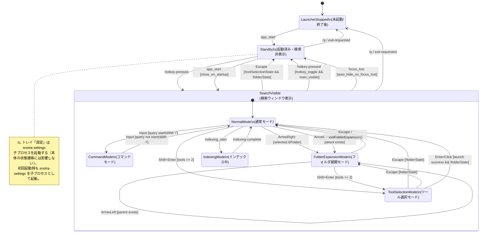

# Snotra 詳細仕様書

## 0. 本書の役割（意図管理）

- 本書（`SPEC.md`）は「何を実現すべきか」を定義する意図管理ドキュメント
- 実装事実（現在どう動いているか）は `snotra-core/src/*.rs`, `src-tauri/src/*.rs`, `ui/src/**` を参照する
- 実装運用ルール（作業手順・判断基準）は `CLAUDE.md` を参照する

不一致がある場合の原則:

- まず「バグ」か「仕様変更」かを判定する
- バグなら、本書の意図に合わせてコードを修正する
- 仕様変更なら、先に本書を更新してからコードを更新する

## 1. 概要

- Windows専用のコマンドライン型キーボードランチャー
- バックエンドは Rust（Tauri v2）、フロントエンドは SolidJS + TypeScript で構築
- Windows 固有機能（ホットキー/トレイ/IME）は `windows` クレートで直接実装
- システムトレイ常駐型、グローバルホットキーで呼び出し

## 2. インデックスシステム

### 2.1 インデックス対象

- ハードコードされたスキャン対象は存在しない。全て `config.toml` の `paths.scan` で管理
- パスごとに拡張子を個別指定可能
- デフォルトスキャン対象（`Config::default_scan_paths()`）:
  - 共通スタートメニュー（`.lnk`）
  - デスクトップ（`.lnk`）
  - ユーザースタートメニューは含めない
- ユーザーがスキャンパスと対象拡張子の組み合わせを設定可能
  - 例: `C:\Tools` -> `.exe, .bat`, `D:\Docs` -> `.pdf, .xlsx`
- フォルダもエントリとして登録（検索対象）
- 隠し/システム項目はデフォルトで除外し、設定で表示可能

### 2.2 エントリ識別子（重複判定・履歴参照）

- エントリの内部一意キーは `正規化済み絶対パス`
- 以下を同一キーで統一する:
  - インデックス重複判定
  - 検索履歴（グローバル頻度・クエリ別頻度）
  - 起動対象の参照

### 2.3 インデックス構築タイミング

- 初回起動時:
  - 設定ファイル（`config.toml`）不在を初回起動と判定
  - 設定画面をインデックスタブで自動表示し、ユーザーにスキャン対象を確認させる
  - 保存時: 設定保存後に設定ウィンドウを閉じ、バックグラウンドで構築開始
  - 未保存で閉じた場合: デフォルト設定でバックグラウンド構築開始
  - 構築中は検索ウィンドウに「インデックス構築中...」メッセージを表示
  - 構築中はトレイメニューで「インデックス再構築中」表示、設定・終了はグレーアウト
  - 構築完了後、検索ウィンドウは通常モードに復帰
- 通常起動時はハイブリッド方式:
  - 起動時はキャッシュを即時ロード
  - バックグラウンドで差分スキャンを実施
  - 差分があればキャッシュを更新
- 設定画面から手動再構築可能

### 2.4 アイコン

- 検索時にオンデマンドで抽出し、PNG バイト列としてキャッシュ・永続化
- `SHGetFileInfoW` → HICON → BGRA → PNG パイプラインで処理（base64 エンコードなし）
- `.lnk` -> 対象ショートカット解決結果に対応するアイコン
- その他 -> シェル登録ファイルタイプアイコン
- フォルダ -> フォルダアイコン
- 表示/非表示は設定で切替可能
- フロントエンドへの転送は `tauri::ipc::Response` でバイナリ IPC（`get_icons_batch`）し、パスごとに `URL.createObjectURL(new Blob([bytes], { type: "image/png" }))` で `` に渡す。バッチ形式: `[count:u32 LE]` + 各アイコン `[status:u8][png_len:u32 LE][png_bytes]`
- アイコン非表示設定時・アイコンデータなし時はフォールバック絵文字（📁📄）を表示
- インデックス再構築時はキャッシュをクリア（次回検索時に再抽出）
- `icons.bin` は起動時に先読みせず、初回アイコン取得（`get_icons_batch`）時に遅延ロード

## 3. 検索システム

### 3.1 検索方式

設定で以下の3種から選択可能（通常時・フォルダ展開時を独立設定）:

- 先頭部分一致: クエリがエントリ名の先頭に一致
- 中間部分一致: クエリがエントリ名の任意位置に一致
- スキップマッチング（ファジー）: `nucleo-matcher` 相当

### 3.2 クエリ正規化

- クエリおよびエントリ名は以下で正規化（全検索モード・フォルダ展開共通）:
  - 前後空白除去（`trim`）
  - 小文字化
  - 連続空白の1文字化
  - ラテン文字のアクセント折りたたみ（é→e, ü→u 等）
- 履歴のクエリキーも同じ正規化を適用し、アクセント違いのバケット分裂を防ぐ

### 3.3 検索結果の優先順位

最終スコア（既定）:

`final_score = base_score + 5 * global_count + 20 * query_count + folder_boost`

- `base_score`: 選択中検索方式のマッチスコア
- `global_count`: アプリ全体の起動回数
- `query_count`: 同一正規化クエリでの当該項目選択回数
- `folder_boost`: フォルダ候補の展開履歴ブースト（非フォルダは0）
- 履歴スコアの時間減衰は行わない

オプション設定（`[search] history_normalization = "fuzzy_relative_cap"`）時:

- Fuzzy モードに限り、履歴加点は `floor(max(base_score, 1) * fuzzy_history_cap_ratio)` を上限とする
- 既定値: `fuzzy_history_cap_ratio = 0.30`

同点時タイブレーク:

1. `last_launched` 降順（新しいもの優先）
2. `name` 昇順

### 3.4 フォルダ候補の追加ブースト

- フォルダ展開回数ブーストはフォルダ候補にのみ適用
- ファイル候補には適用しない

### 3.5 最大列挙数

- 設定で候補リストの最大表示件数を指定可能（デフォルト: 8）

### 3.6 空クエリ時

- 検索ボックスが空のときは候補を表示しない
- 直近履歴は `/r` コマンドで明示的に表示する（§14.2 参照）

### 3.7 結果表示同期契約（3イベント分割）

- 検索結果の表示同期は以下の3イベントで行う（選択変更時の不要な配列シリアライズを回避）
- **`results-data-changed`**: 結果配列が変わったとき
  - `generation`: リクエスト世代番号。受信側は古い世代を破棄する
  - `results`: 表示候補配列
  - `selected`: 選択インデックス
  - `shouldShow`: 結果ウィンドウを表示すべきか
  - `reason`: 送信理由（`query` / `command` / `selection` / `reset` / `launch`）
- **`results-selection-changed`**: 選択インデックスのみ変わったとき（配列を送らない）
  - `generation`: リクエスト世代番号
  - `selected`: 選択インデックス
- **`results-visibility-changed`**: 結果ウィンドウを非表示にするとき（配列を送らない）
  - `generation`: リクエスト世代番号
  - `shouldShow`: 常に `false`
  - `reason`: 送信理由（`command` / `reset` / `launch`）
- 表示制御は `shouldShow`（`results-data-changed` / `results-visibility-changed`）を唯一の真実源として扱う

## 4. 履歴・優先度システム

### 4.1 記録内容

- グローバル起動履歴: 項目ごとの総起動回数
- クエリ単位の選択履歴: `(正規化クエリ, 項目ID)` ペア
- フォルダ展開履歴: フォルダの展開回数

### 4.2 データ保存

- バイナリ形式で `%APPDATA%\Snotra\` に保存
- グローバル起動回数の上位N件のみ保存（Nは設定値）
- クエリ単位履歴は上位N件に含まれる項目のみ保持
- `last_launched` は Unix epoch ミリ秒（ms）で保持する

## 5. フォルダ展開機能

### 5.1 基本動作

- 右カーソルキー:
  - 選択中がフォルダなら、そのフォルダ内容で候補を置換
  - 選択中がファイルなら無反応
- 左カーソルキー:
  - 展開中: 親フォルダ内容で候補を置換（ルート到達時は無反応）
  - 通常検索モード: 選択中アイテムの親ディレクトリを展開してフォルダ展開モードに遷移

### 5.2 ルート定義

- ローカルドライブ: `C:\` などドライブ直下
- UNC: `\\server\share\` 共有ルート
- 上記を終端として、これ以上の左遷移は行わない

### 5.3 フォルダ展開中の検索

- 文字入力時は現在フォルダ内で絞り込み
- 検索対象は表示名のみ（フルパスは対象外）
- 検索方式は「フォルダ展開時」の設定に従う

### 5.4 フォルダ展開からの復帰

- `Escape` で展開開始前の検索状態に一気に復帰
  - 元の候補一覧
  - 選択位置
  - クエリ文字列

### 5.5 フォルダのEnter操作

- フォルダ選択でEnter: エクスプローラーでそのフォルダを開く
- フォルダ展開操作は右カーソルキー（フォルダの中身）または左カーソルキー（親ディレクトリ）

### 5.6 列挙失敗時

- アクセス拒否などで列挙に失敗した場合:
  - 候補リストに単一のエラー行を表示
  - エラー行でEnterは無効
  - 右/左/Escapeは通常どおり有効

## 6. 設定画面

### 6.1 実装方式

- 設定画面は独立した egui バイナリ `snotra-settings` として実装
- 本体（`snotra`）から `std::process::Command` で子プロセスとして起動
- `/o` スラッシュコマンドまたはトレイメニュー「設定」で開く
- `snotra-settings --tab about` で「Snotra について」タブを初期表示
- 設定の保存は `snotra-settings` が直接 `config.toml` に書き込み、本体は `notify` ファイル監視で検知・反映する
- タブ切り替えUI

### 6.2 タブ構成と設定項目

`[全般]` タブ:

- ホットキー（修飾キー + キー）
- 呼び出しキーで表示/非表示トグル
- 起動時にウィンドウ表示するか
- フォーカス喪失時の自動非表示
- タスクトレイアイコン表示切替
- 入力ウィンドウ表示時にIMEをオフ（復元なし）
- 最大表示件数
- ウィンドウ幅
- アイコン表示切替

`[検索]` タブ:

- 通常時検索方式
- フォルダ展開時検索方式
- 隠し/システム項目表示
- 履歴保存の上位N件指定

`[インデックス]` タブ:

- インデックス条件一覧（パス + 拡張子）
  - 追加/編集/削除

`[ビジュアル]` タブ:

- プリセットテーマ選択（色セット）
- 背景色、入力欄背景色、テキスト色、選択行色、ヒント文字色
- フォントファミリー、フォントサイズ

`[オープナー]` タブ:

- カスタムオープナールール一覧（詳細は §17 参照）
- ルール追加/編集/削除
- ツール追加/編集/削除/並び替え（順序 = 優先度）

### 6.3 初期設定に戻す

- 設定フッターに「初期設定に戻す」ボタンを表示する
- ボタン押下時、`Config::default()` 相当の値をドラフトに適用する（保存は行わない）
- 二段階押し方式で誤操作を防止する: 初回クリックで確認テキストに変わり、再クリックで実行。3秒経過で自動解除

### 6.4 設定反映タイミング

- `snotra-settings` が `config.toml` を保存すると、本体の `config_watcher`（`notify` ファイル監視）が変更を検知し設定を再読み込みする
- ホットキー: 検知時に `PlatformCommand::SetHotkey` で再登録（失敗時は旧設定維持）
- トレイアイコン: 検知時に `PlatformCommand::SetTrayVisible` で切替
- 検索方式/最大件数: 検知後即時反映
- 見た目設定: 検知時に `visual-config-changed` イベントで全ウィンドウの CSS 変数を即時更新
- ウィンドウ幅: 検知時に `set_size` で main/results ウィンドウを即時リサイズ
- インデックス条件（スキャンパス・隠しファイル表示）・アイコン設定:
  - 検知時に変更を判定し、バックグラウンドで自動再構築
  - ステータスに「インデックスを再構築中…」を表示

### 6.5 起動時ブートストラップ

- 起動直後のUI初期化は `get_bootstrap_payload` を使い、`visual`・`general.auto_hide_on_focus_lost`・`indexing` を一括取得する
- メインウィンドウはこのペイロードで初期テーマ適用とフォーカス喪失時自動非表示の有効化可否を決定する

## 7. ウィンドウ動作

### 7.1 表示/非表示

- ホットキーで表示
- `Escape` で非表示（ただしツール選択中→フォルダ展開中の順で内側の復帰が優先）
- フォーカス喪失時の自動非表示（`onFocusChanged` イベント、設定で切替、100ms 猶予付き）
- ホットキーでのトグル動作（設定で切替）

### 7.2 ウィンドウ位置

- 検索ウィンドウは検索バーの余白部分（padding 領域）をドラッグして移動可能
- 移動位置をデバウンス保存し次回表示時に復元
- 検索ウィンドウは位置を記憶（設定ウィンドウは別プロセスのため本体では管理しない）
- `window.bin` にバイナリ形式で保存

### 7.3 タイトルバー

- タイトルバーは常に非表示（`tauri.conf.json` の `"decorations": false`）
- `data-tauri-drag-region` による検索バー余白ドラッグで移動

### 7.4 起動時表示制御

- `main` ウィンドウは `visible: false` で作成し、条件付きで `window.show()` を呼ぶ
- `show_on_startup = false` の場合は非表示常駐でホットキー待ち

### 7.5 サブウィンドウ生成タイミング

- `results` ウィンドウは起動時のセットアップで事前生成（`visible: false`）
- 初回表示時は既存インスタンスを `show` する
- `about` / `settings` は別プロセス（`snotra-settings`）として起動。本体は `SettingsProcessState`（`Mutex<Option<Child>>`）で子プロセスを管理し、二重起動を防止する
- `snotra-settings` 起動中は本体のメインウィンドウの `alwaysOnTop` を一時的に `false` にし、終了検知時に `true` に復元する
- `platform/mod.rs` の Win32 メッセージループスレッドは `results` ウィンドウ事前生成より前に spawn し、Win32 初期化とウィンドウ生成を並列実行する（起動時間の短縮）
- トレイアイコンの表示は `results` ウィンドウの事前生成完了後に行う
- ホットキー登録（`RegisterHotKey`）は `hotkey-pressed` イベントリスナーの登録完了後に行う。リスナー未登録の状態でホットキーを有効化すると、起動中のキー入力が受け手なく破棄されるため

### 7.6 状態遷移図

遷移ルール要約（主要ガード条件）:

- `/o` は `snotra-settings` 子プロセスを起動する（`!indexing` のときのみ有効）。本体の状態は変わらない
- トレイ「設定」も `snotra-settings` 子プロセスを起動する（`!indexing` のときのみ有効）
- `Standby -> SearchVisible` は `hotkey-pressed` に加えて、起動直後 `app_start [show_on_startup]` でも成立
- `SearchVisible -> Standby` の `Escape` は `!toolSelectionState && !folderState` の場合のみ成立（`toolSelectionState` 中は `ToolSelectionMode -> NormalMode/FolderExpansionMode` を優先し、`folderState` 中は `FolderExpansionMode -> NormalMode` を優先）
- `SearchVisible -> Standby` の `hotkey-pressed` は `hotkey_toggle && main_visible` が前提
- `SearchVisible -> Standby` の `focus_lost` は `auto_hide_on_focus_lost` 有効時のみ成立
- `/q` または `exit-requested` は `Standby` / `SearchVisible` のいずれからでも `LauncherStopped` へ遷移
- `/o` 実行時に `indexing == true` の場合、`open_settings` は no-op
- 初回起動（`is_first_run`）では `snotra-settings` を子プロセスとして直接起動する（indexing ガードをバイパス）
- `snotra-settings` 起動中のホットキー入力は無視する（ホットキー再設定中の誤動作防止）

## 8. 実行履歴メニュー

- `/r` コマンドで最近の実行履歴を候補表示（§14.2 参照）
- 表示件数は設定値（実行履歴メニュー最大件数）

## 9. システムトレイ

- Win32 `Shell_NotifyIconW` で実装（`platform/tray.rs`）
- トレイアイコン表示は設定で切替
- 右クリックメニュー: 「設定」「終了」
- キーボードフォーカス + Shift+F10 / Application キー: 右クリックと同じコンテキストメニューを表示
- 左クリック: 最近の実行履歴をポップアップメニューとして表示。履歴からの起動にもオープナールールが適用される（§17 参照）
- トレイアイコンは `results` ウィンドウの事前生成完了後に表示する（§7.5 参照）
- `show_on_startup = true` の起動時は、検索UI（入力欄/結果）を起動直後から表示する
- `show_on_startup = false` の起動時は検索UI（入力欄/結果）を表示しない
- `show_on_startup = false` かつ `show_tray_icon = true` の場合は、可視要素はトレイアイコンのみ
- `show_on_startup = false` かつ `show_tray_icon = false` の場合も非表示常駐し、ホットキー入力で表示可能
- トレイから設定を開くときは検索UIを同時表示せず、設定画面のみ表示する
- ホットキー登録失敗時は操作不能回避のため検索UIを表示する

## 10. ビジュアル

- CSS カスタムプロパティによるテーマシステム
- プリセットテーマ方式（色セット）
- 管理項目:
  - 背景色、入力欄背景色、テキスト色、選択行色、ヒント文字色
  - フォントファミリー、フォントサイズ
- 設定保存時に `document.documentElement.style.setProperty()` で即時反映
- 検索結果はフルパスの1行表示
  - 長いパスは中間セグメントを `...` で省略し、ウィンドウ幅に応じて自動調整
  - フォルダは末尾 `\` で区別

## 11. IME制御

- 設定で有効/無効切替
- 有効時はウィンドウ表示時にIMEをオフ
- 非表示時のIME復元は行わない

## 12. データ保存

### 12.1 設定データ

- `%APPDATA%\Snotra\config.toml`（TOML）
- 欠損キーはデフォルト補完
- 未知キーは無視して読み込み継続

### 12.2 アプリケーションデータ（バイナリ）

用途別ファイル分割:

- `%APPDATA%\Snotra\index.bin`
- `%APPDATA%\Snotra\icons.bin`
- `%APPDATA%\Snotra\history.bin`
- `%APPDATA%\Snotra\window.bin`

共通保存仕様:

- 先頭に `magic + u32 version` ヘッダ
- 保存手順は `tmp書込 -> rename` の原子的置換
- 読み込み失敗（magic/version/deserialize）時は当該ファイルのみ再生成
- 起動時整合性チェックは軽量:
  - ヘッダ検証
  - deserialize可否
  - `index.bin` は config hash 整合性確認

## 13. 実行仕様（起動）

### 13.1 `.lnk` 実行

- `.lnk` はショートカット本体を `ShellExecute` で起動
- ターゲット直接実行への変換は行わない

### 13.2 起動API契約（launch_item）

- `launch_item` は非同期コマンドとして実装し、OS実行結果を待ってフロントへ DTO を返す
- 戻り値は `LaunchResult { status, code, message }`
  - `status`: `ok` / `failed` / `timeout`
  - `code`: OS戻りコード（timeout 時は `-1`）
  - `message`: 追加情報（任意）
- 起動成功（`status = ok`）時のみ履歴を記録する
- OS呼び出しはタイムアウト付きで待機する（既定 4000ms）
- フロントは実行中状態（ローディング）を表示し、失敗・タイムアウト時は通知を表示する
- 通知の自動クリアは単一タイマーで管理し、連続失敗時は前回タイマーを clear して再設定する

## 14. スラッシュコマンド

### 14.1 概要

検索ボックスで `/` から始まるテキストを入力すると、即座にコマンドモードへ遷移する。コマンド文字列が完全一致した時点で Enter なしに即実行される。

補足:

- 先頭 `/` はコマンドモードを優先する
- 先頭 `/` ではない入力で `/` または `\` を含む場合は、通常検索ではなくパス（フォルダ）検索として扱う

### 14.2 コマンド一覧

| コマンド | 動作                         |
| -------- | ---------------------------- |
| `/o`     | 設定ウィンドウを開く         |
| `/s`     | インデックス再構築を開始する |
| `/q`     | アプリを終了する             |
| `/r`     | 直近履歴を表示する           |

### 14.3 即実行仕様

- コマンド文字列（例: `/o`）が入力された時点で `createEffect` が発火し、debounce をキャンセルして即座に `action()` を実行する
- 実行後はクエリをクリアし、結果を空にする
- コマンドモード中は通常検索（インデックス検索）を実行しない

### 14.4 フォルダ展開中の挙動

- フォルダ展開中はスラッシュコマンドを無視し、通常のフォルダフィルタとして処理する

## 15. 非機能要件

- ウィンドウ表示開始まで: 500ms未満（通常起動、WebView2 ウォーム起動）
- 通常検索応答: 30ms未満（キー入力から候補更新）
- Tauri IPC オーバーヘッド: 通常 2ms 未満
- 初回再構築・手動再構築は進捗表示を持つ

## 16. データ互換・マイグレーション

### 16.1 履歴フォーマット互換

- `history.bin` は version ヘッダで管理し、現行は V3（`last_launched` ms）とする
- 読み込みは `V3 -> V2 -> V1` の順でフォールバックする
- V1/V2（秒単位）を読み込んだ場合は、正規化・統合処理より先に `ms` へ変換する
  - 変換規則: `last_launched = last_launched.saturating_mul(1000)`
- キー正規化（大文字小文字統合）時の衝突解決で `max(last_launched)` を使うため、単位混在のまま統合してはならない
- マイグレーション時はクエリキー（外部）にもアクセント正規化を適用し、アクセント違いのバケットを統合する（衝突時はカウント加算）
- パスキー（`normalize_entry_key`）: lowercase + パス区切り正規化のみ。アクセント折りたたみは行わない（パスは識別子であり、`Résumé.lnk` と `Resume.lnk` は別ファイル）
- クエリキー（`normalize_query`）: lowercase + 空白統一 + アクセント折りたたみ（é→e 等）を適用する

## 17. カスタムオープナー機能

### 17.1 概要

ファイルやフォルダを開く際、Windows の既定プログラム（ShellExecuteW）の代わりに、ユーザーが設定した任意のツールに渡せる機能。

### 17.2 設定構造

- `config.toml` の `[[openers]]` セクションでルールを定義
- 各ルールは `target`（マッチ条件）と `tools`（ツール一覧）を持つ
- `target = "folder"`: 全フォルダにマッチ
- `target = "ext:png,jpg,gif"`: 指定拡張子のファイルにマッチ（カンマ区切り、ドット有無問わず）
- 1ルールに複数ツールを登録可能（順序が優先度）
- `tools` の各エントリ: `name`（表示名）、`exe`（実行ファイルパス）、`args`（固定引数、省略可）

### 17.3 起動フロー

- **全起動経路統一**: 通常 Enter・Shift+Enter・クリック・トレイ履歴メニューのすべてでオープナールールを適用する（起動経路に関わらず同一パスは同じオープナーで開かれる）
- 通常 Enter: マッチするルールの先頭ツールで起動
- Shift+Enter:
  - マッチするツールが2件以上: ツール選択メニューを表示
  - マッチするツールが1件以下: 通常 Enter と同じ動作（ウィンドウも同様に閉じる）
- クリック: 表示リストの行インデックスで選択ツールを一意に照合し起動（同一 exe を持つ複数ツールを正確に区別）
- マッチするルールがない場合: 従来どおり ShellExecuteW でフォールバック
- ツール引数: 通常は固定引数の後にパスを末尾に付加。`{path}` を含む場合はその位置に実パスを展開し、末尾への自動追加は行わない

### 17.4 ツール選択メニュー

- 検索結果リストをツール一覧で置換（フォルダ展開と同じモデル）
- Escape でメニューを閉じて元の状態に復帰（フォルダ展開中の場合はフォルダ展開に復帰）
- Enter で選択中ツールを起動
- クリックで任意の行のツールを起動（リスト行インデックスで照合するため、同一 exe でも引数が異なるツールを正確に区別できる）

### 17.5 状態モデル

- `toolSelectionState` は `folderState` と直交する（フォルダ展開中でも Shift+Enter でツール選択に入れる）
- 優先度: `toolSelectionState !== null` > `folderState !== null` > 通常モード
- ツール選択中の入力は無効化（検索結果が上書きされない）
- ツール選択中の ArrowRight/ArrowLeft は無効化
- ホットキーによる再表示（`resetForShow`）でツール選択はリセットされる

### 17.6 設定画面

- 設定画面に「オープナー」タブを追加（全般/検索/インデックス/ビジュアル/オープナー）
- ルール追加/編集/削除
- ツール追加/編集/削除/並び替え（順序 = 優先度）
- exe パス入力にファイルブラウズダイアログ
