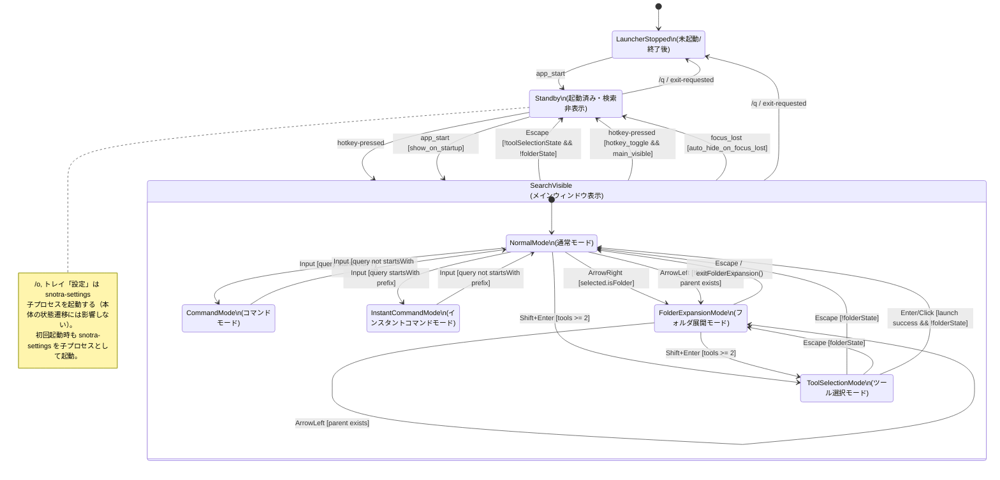

# Snotra 詳細仕様書

## 0. 本書の役割（意図管理）

- 本書（`SPEC.md`）は「何を実現すべきか」を定義する意図管理ドキュメント
- 実装事実（現在どう動いているか）は `snotra-core/src/*.rs`, `src-tauri/src/*.rs` を参照する
- 実装運用ルール（作業手順・判断基準）は `AGENTS.md` を参照する

不一致がある場合の原則:

- まず「バグ」か「仕様変更」かを判定する
- バグなら、本書の意図に合わせてコードを修正する
- 仕様変更なら、先に本書を更新してからコードを更新する

## 1. 対象ユーザーとコア体験

### 対象ユーザー
- キーボード中心で作業するソフトウェア開発者（Windows 中級者）
- アプリもフォルダも数十分に1回の頻度でサッと起動したい
- Win+S の検索精度・表示速度・フォルダ探索の弱さに不満がある

### コア体験
ホットキー → 数文字入力 → 結果を見て選択 → Enter で起動完了。数秒以内。

### スコープ境界
- **やること**: アプリ・フォルダの高速検索と起動、履歴による学習、インスタントコマンド（@プレフィックス）によるユーザー定義コマンド実行、カスタムオープナーによる起動先のカスタマイズ、テーマ・ホットキー等の基本カスタマイズ
- **やらないこと**: ファイル内容検索、ウィジェット/情報表示、プラグインエコシステム

### 設定コスト
デフォルトで実用的に使える。初回15分の設定で自分好みになり、以降はほぼ触らない。

## 2. 概要

- Windows専用のコマンドライン型キーボードランチャー
- 全層 Rust（Tauri v2 ランタイム + egui/softbuffer 検索 UI・#532 で WebView2/SolidJS フロントを撤去）
- Windows 固有機能（ホットキー/トレイ/IME）は `windows` クレートで直接実装
- システムトレイ常駐型、グローバルホットキーで呼び出し
- 日本語・英語の2言語対応。OS の言語設定から初期言語を自動判定し、対応言語がない場合は英語をデフォルトとする。設定画面から切替可能

## 3. インデックスシステム

### 3.1 インデックス対象

- ハードコードされたスキャン対象は存在しない。全て `config.toml` の `paths.scan` で管理
- パスごとに拡張子を個別指定可能
- デフォルトスキャン対象（`Config::default_scan_paths()`）:
  - 共通スタートメニュー（`.lnk`）
  - デスクトップ（`.lnk`）
  - ユーザースタートメニューは含めない
- ユーザーがスキャンパスと対象拡張子の組み合わせを設定可能
  - 例: `C:\Tools` -> `.exe, .bat`, `D:\Docs` -> `.pdf, .xlsx`
- ユーザー PATH 環境変数（`HKCU\Environment\Path`）の実行ファイルを検索対象に追加可能（設定で有効化、デフォルト無効）
  - 対象拡張子: `.exe`, `.bat`, `.cmd`
  - `REG_EXPAND_SZ` 形式の値は環境変数を展開してから読み取る
  - `paths.scan` に同一パスが含まれる場合は重複排除される
- フォルダもエントリとして登録（検索対象）
- 隠し/システム項目はデフォルトで除外し、設定で表示可能

### 3.2 エントリ識別子（重複判定・履歴参照）

- エントリの内部一意キーは `正規化済み絶対パス`
- 以下を同一キーで統一する:
  - インデックス重複判定
  - 検索履歴（グローバル頻度・クエリ別頻度）
  - 起動対象の参照

### 3.3 インデックス構築タイミング

- 初回起動時:
  - 設定ファイル（`config.toml`）不在を初回起動と判定
  - 設定画面をインデックスタブで自動表示し、ユーザーにスキャン対象を確認させる
  - 保存時: 設定保存後に設定アプリを閉じ、バックグラウンドで構築開始
  - 未保存で閉じた場合: デフォルト設定でバックグラウンド構築開始
  - 構築中はメインウィンドウに「インデックス構築中...」メッセージを表示
  - 構築中はトレイメニューで「インデックス再構築中」表示、設定・終了はグレーアウト
  - 構築完了後、メインウィンドウは通常モードに復帰
- 通常起動時はハイブリッド方式:
  - 起動時はキャッシュを即時ロード
  - バックグラウンドで差分スキャンを実施
  - 差分があればキャッシュを更新
  - 差分スキャン開始前に権威的なインデックス再構築が始まった場合、古い差分スキャンはスキップする
- 設定画面から手動再構築可能

### 3.4 アイコン

- 検索時にオンデマンドで抽出し、PNG バイト列としてキャッシュ・永続化
- `SHGetFileInfoW` → HICON → BGRA → PNG パイプラインで処理（base64 エンコードなし）
- `.lnk` -> 対象ショートカット解決結果に対応するアイコン
- その他 -> シェル登録ファイルタイプアイコン
- フォルダ -> フォルダアイコン
- 表示/非表示は設定で切替可能
- UI への受け渡しは worker スレッドの `commands::load_icon_pngs` → ColorImage decode → `load_texture`（`egui_shell/icon_textures.rs`・#532 SU4）
- アイコン非表示時はスロットを畳み、データなし時は単色の drawn placeholder を描く（softbuffer + 単一 TTF で色 emoji が描けない懸念のため・#532 SU4）
  - emoji への upgrade を検討する場合、**「jp_font が 📁📄 を描けるか」を前提にできない**（#689）: Yu Gothic フォールバックは条件付きになり、ユーザーフォントが CJK を被覆する構成では積まれない。判定に使うのは実際にその環境で先頭に来るフォントであって、jp_font ではない
- インデックス再構築時はキャッシュをクリア（次回検索時に再抽出）
- `icons.bin` は起動時に先読みせず、初回アイコン取得時に遅延ロード
- 件数上限を超えると挿入順で最古から退避（FIFO）し、常駐メモリと `icons.bin` の両方を頭打ちにする。退避は書き込み経路（挿入・ロード）でのみ行い、取得（`get`）はアクセス順を更新しない。上限は独立した設定キーを持たず、表示ワーキングセット `max(visible_rows, result_limit, recent_limit)`（アイコンを要求しうる結果リストの最大件数＝フロント先読み・`LruIconCache` サイズ）の定数倍（実装は ×5、既定 200×5=1000）として導出する。これにより「上限 ≥ ワーキングセット」を検証なしで構造的に保証し、単一の `get_icons_batch` が自己 evict することはなく、`result_limit` 変更時は上限も自動追従する

## 4. 検索システム

### 4.1 検索方式

設定で以下の3種から選択可能（通常時・フォルダ展開時を独立設定）:

- 先頭部分一致: クエリがエントリ名の先頭に一致
- 中間部分一致: クエリがエントリ名の任意位置に一致
- スキップマッチング（ファジー）: `nucleo-matcher` 相当
- ローマ字検索（設定で有効化、デフォルト無効）: クエリが ASCII のみかつ最小文字数以上の場合、
  ひらがな変換してエントリのかな正規化名に中間部分一致で検索する（カタカナ名対応、漢字名は対象外）。
- パスマッチング: クエリにパス区切り文字（`/` `\`）が含まれる場合、エントリ名に加えて `target_path`
  に対しても中間部分一致で検索する。`tool/editor` と入力すると `C:\tool\editor\app.exe` にヒットする。
  クエリ内の `/` は `\` に正規化してからマッチングする。

### 4.2 クエリ正規化

- クエリおよびエントリ名は以下で正規化（全検索モード・フォルダ展開共通）:
  - 前後空白除去（`trim`）
  - 小文字化
  - 連続空白の1文字化
  - ラテン文字のアクセント折りたたみ（é→e, ü→u 等）
- 履歴のクエリキーも同じ正規化を適用し、アクセント違いのバケット分裂を防ぐ
- ローマ字検索時の追加処理: `migemo_enabled` が true かつクエリが ASCII のみかつ
  `migemo_min_chars` 以上の場合、`to_hiragana()` で `kana_query` を生成し、
  エントリのかな正規化名に中間部分一致する（score: max(4500 - byte_pos, 1)）。
  直接一致（Prefix/Substring/Fuzzy）のスコアより低い。
  `kana_query` に ASCII アルファベットが残留する場合は使用しない。

### 4.2.1 インクリメンタル検索の不変条件

増分検索（前回の候補集合を再利用）を使えるのは、今回の検索条件が前回条件の部分集合であるときだけ。
具体的には以下の全条件を満たすこと:

1. 検索モードが前回と同一
2. 今回のクエリが前回クエリの prefix 拡張
3. ドット含有が広がらない（no-dot→dot 遷移は full scan）
4. `kana_query` が単調: (a) 今回 None なら無条件 OK、(b) 今回 Some なら前回も Some かつ
   今回の kana 文字列が前回の prefix 拡張であること

条件4の背景: ローマ字→かな変換は文字列伸長に対して非単調（"kan"→"かん", "kana"→"かな"）。
bool フラグでは検知できず、実際の kana 文字列の `starts_with` 比較が必要。

### 4.3 検索結果の優先順位

最終スコア（既定）:

`final_score = base_score + 5 * global_count + 20 * query_count + folder_boost`

- `base_score`: 選択中検索方式のマッチスコア。名前マッチ（Prefix/Substring/Fuzzy）・かなマッチ・パスマッチの順で試行し、最初にヒットしたスコアを使用する。パスマッチのベーススコアは `3000`（名前マッチ・かなマッチより低い）
- `global_count`: アプリ全体の起動回数
- `query_count`: 同一正規化クエリでの当該項目選択回数
- `folder_boost`: フォルダ候補の展開履歴ブースト（非フォルダは0）。`expansion_count * 5`（`FOLDER_EXPANSION_WEIGHT = 5`）
- 履歴スコアの時間減衰は行わない

オプション設定（`[search] history_normalization = "fuzzy_relative_cap"`）時:

- Fuzzy モードに限り、履歴加点は `floor(max(base_score, 1) * fuzzy_history_cap_ratio)` を上限とする
- 既定値: `fuzzy_history_cap_ratio = 0.30`

同点時タイブレーク:

1. `last_launched` 降順（新しいもの優先）
2. `name` 昇順

### 4.4 フォルダ候補の追加ブースト

- フォルダ展開回数ブーストはフォルダ候補にのみ適用
- ファイル候補には適用しない

### 4.5 最大列挙数

- 設定で候補リストの最大表示件数を指定可能（デフォルト: 8）
- 検索結果ウィンドウ（`results`）の高さは実件数にフィットする（`min(表示件数, 最大表示件数) × 行高 + 8px`）。ヒット数が最大表示件数未満なら高さも小さくなり、超過時はスクロールバーを表示する（#646 PR2 決定7）
- **ただし作業領域の下端を超える場合はそこでクランプする**（#675）。あふれた行はスクロールで到達する。作業領域の残りが 1 行に満たない場合でも 1 行分（+ padding）は表示し、そのぶんのはみ出しは受容する——0 まで潰すと「メインウィンドウを画面下端へ置くと結果が一切出ない」という別の欠陥になるため。作業領域を取得できない環境ではクランプしない

### 4.6 空クエリ時

- 検索ボックスが空のときは候補を表示しない
- 直近履歴は `/r` コマンドで明示的に表示する（§15.2 参照）

### 4.7 結果表示制御（2 窓構成）

- メインウィンドウ（`main`）と検索結果ウィンドウ（`results`）は分離した 2 つのウィンドウで構成する（#646 PR2）。`results` は `main` に従属し、フォーカスを取らない（§8.5 参照）
- 結果の表示/非表示は `results` が空なら非表示。ツール選択・フォルダ展開ビューはインデックス構築中でも表示し、通常結果ビューはインスタントコマンドモードまたは非インデックス時に表示する（2 軸モデルから導出）
- `main` の高さは `bar_height`（+ status 行・toast 行が出ていればそれぞれ `toast_height` を加算）のみで、結果表示による伸縮はしない。`results` の高さは実件数フィット（§4.5）で `main` が算出し `set_size()` する（旧 `compute_window_height` は撤去済み・#646 PR2 決定6/7）
- **インデックス構築案内・起動中・一時通知は検索バーの直下に独立した status 行として描き、入力欄には重ねない**（#700）。重ねると入力欄が編集可能なまま文字が見えなくなり、編集不能として観測される。status 行と toast 行は独立に積む（同時成立時にどちらも隠さない）
- **これらの案内の描画面は status 行ただ 1 つで、クエリの空/非空では切り替えない**（#700）。入力欄の hint は本来のプレースホルダに徹する——2 面あると打鍵の瞬間に案内が入力欄から status 行へ飛ぶ（実機で観測）
- **この規則が言う「案内」は、いま何が起きているかのお知らせ（インデックス構築中・起動中・一時通知）である。** 入力欄のプレースホルダが担う「いま入力すると何が起きるか」の説明はこれと別物で、フォルダ展開中の現在地表示がそれにあたる（`SPEC.md`「6.7 フォルダ展開中の現在地表示」）。どちらも描画面は 1 つずつであり、同じ情報を 2 面に持つことはしない
- show 時に毎回検索バー高さ（`font_size + bar_padding`・既定 43px）にリセットする。status / toast 表示時のみ行を加算し、結果件数による `main` の伸縮はしない（#646 PR2 決定6）
- show 時は幅も設定値（`appearance.window_width`）へ揃えてから位置を決める。非表示中の設定変更を表示の瞬間に反映するためで、揃えないと表示直後の最初のフレームが書き直して幅がスナップする（#824）

### 4.8 マウス操作

- ホバー: 通常の非選択行は、`selected_row_color` の 50% 透明色へ短くフェードインし、
  ポインタが外れると透明へフェードアウトする。ホバーで `selected` 状態は変化しない。
  選択行は `selected_row_color` の通常表示を優先し、エラー行にはホバー視覚を出さない（#724）
- シングルクリック: アイテムを起動する（起動成功時にウィンドウを非表示にする）
- 結果は `main` に従属する独立ウィンドウ（`results`）に描画され、フォーカスを取らない（`focusable(false)`）。クリック中も入力欄のキーボードフォーカスは継続する（§8.5 参照・#646 PR2 決定4）
- ダブルクリック: 独立した挙動は持たない。単クリックが先に起動・非表示にするため、
  「ダブルクリックで選択のみ」は到達しない（as-built）
- キーボードナビゲーション（Arrow ↑↓）とマウス操作は互いに干渉しない
- **↑↓ は結果選択に専有され、入力欄のテキストキャレットを動かさない**（#700）。入力欄はフォーカスを保持したままなので、↑↓ で選択を変えた直後の打鍵は**直前の編集位置**へ入る（driver が ↑↓ のキーイベントを消費して入力欄へ渡さないことで担保する）

## 5. 履歴・優先度システム

### 5.1 記録内容

- グローバル起動履歴: 項目ごとの総起動回数
- クエリ単位の選択履歴: `(正規化クエリ, 項目ID)` ペア
- フォルダ展開履歴: フォルダの展開回数

### 5.2 データ保存

- バイナリ形式で `%APPDATA%\Snotra\` に保存
- グローバル起動回数の上位N件のみ保存（Nは設定値）
- クエリ単位履歴は上位N件に含まれる項目のみ保持
- `last_launched` は Unix epoch ミリ秒（ms）で保持する

## 6. フォルダ展開機能

### 6.1 基本動作

- 右カーソルキー:
  - 選択中がフォルダなら、そのフォルダ内容で候補を置換
  - 選択中がファイルなら無反応
- 左カーソルキー:
  - 展開中: 親フォルダ内容で候補を置換（ルート到達時は無反応）
  - 通常検索モード: 選択中アイテムの親ディレクトリを展開してフォルダ展開モードに遷移
- 左右カーソルキーがフォルダ内容で候補を置換したときの選択:
  - 打鍵した時点で選択は 1 行目へ移り、直前の選択を引き継がない（**この時点の候補はまだ置換前のものである**——置換は次項のとおり非同期に起きる）
  - 置換後の候補は非同期に届く。到着時に選択を 1 行目へ戻すことはせず、届いた件数の範囲内へ収めるだけである（到着を待つ間に上下カーソルキーで動かした選択は、範囲内であればそのまま残る）。0 件のときは選択の指す行が無い
  - 置換後の 1 行目が何になるかはフォルダ内の並び順が決めるため、直前まで居たフォルダの行が選ばれることは保証しない
  - **フォルダ内の絞り込み文字列（§6.3）はクリアされる**（as-built）。左右どちらの遷移でも、遷移した時点で入力欄は空に戻る

### 6.2 ルート定義

- ローカルドライブ: `C:\` などドライブ直下
- UNC: `\\server\share\` 共有ルート
- 上記を終端として、これ以上の左遷移は行わない

### 6.3 フォルダ展開中の検索

- 文字入力時は現在フォルダ内で絞り込み
- 検索対象は表示名のみ（フルパスは対象外）
- 検索方式は「フォルダ展開時」の設定に従う

### 6.4 フォルダ展開からの復帰

- `Escape` で展開開始前の検索状態に一気に復帰
  - 元の候補一覧
  - 選択位置
  - クエリ文字列
  - 入力欄のキャレットは、復元したクエリ文字列の末尾へ置く（#840）

### 6.5 フォルダのEnter操作

- フォルダ選択でEnter: エクスプローラーでそのフォルダを開く
- フォルダ展開操作は右カーソルキー（フォルダの中身）または左カーソルキー（親ディレクトリ）

### 6.6 列挙失敗時

- アクセス拒否などで列挙に失敗した場合:
  - 候補リストに単一のエラー行を表示
  - エラー行でEnterは無効
  - 右/左/Escapeは通常どおり有効

### 6.7 フォルダ展開中の現在地表示

- フォルダ展開中は、検索入力欄のプレースホルダを「`<現在のディレクトリのフルパス>` 内を検索...」（英語 UI では `Search in <path>...`）に差し替える。フォルダ名だけではなくフルパスを出す（#836）
- **プレースホルダゆえ、フォルダ内の絞り込み文字列が空のときだけ表示される**。1 文字でも入力すると消え、消すと戻る（受容する残余）。左右カーソルキーは絞り込みをクリアする（`SPEC.md`「6.1 基本動作」）ので、階層を移動した直後は必ず表示される
- ツール選択が上に積まれている間は、ツール選択のプレースホルダが優先する（優先度 ツール選択 > フォルダ展開 > 通常検索。§18.5 の状態モデルと一対一）
- **表示は打鍵したフレームで同期に更新され、候補の入れ替わりより先に変わる**。候補は非同期に届く（§6.1）ため、列挙が未着の間も、列挙に失敗したとき（§6.6）も、0 件のときも、遷移先のディレクトリを示し続ける
- **現在地の描画面はこのプレースホルダただ 1 つである**（§4.7 の「同じ情報に描画面を 2 つ持たない」の適用）。候補行に出るパスは項目ごとのデータであって現在地のラベルではない。ステータス行にも検索結果ウィンドウにも現在地は出さない
- 入力欄の幅に収まらないパスは**中間を `…` で省略し、ドライブ（先頭）といま居るフォルダ名（末尾）の両方を残す**（#870）。省略が当たるのはパスだけなので、日本語 UI の接尾辞「 内を検索...」も英語 UI の接頭辞「Search in 」も削られない
- **区別が保たれる条件**（受容する残余）: **leaf 全体が残るのは leaf がパス予算のおよそ半分に収まるときだけ**で、足りなければ leaf も途中から削れる。残るのは leaf の**末尾**なので、**兄弟ディレクトリの差分が残った末尾側に含まれるかぎり**同一表示に潰れない。潰れうるのは 2 通り——差分が leaf の先頭側にしか無く leaf が予算を超える場合と、入力欄が極端に狭くどの候補も収まらない場合（最短の 4 字版へ落ちる）
- 既定幅 600px・日英双方での実測（2026-08-01）: パス 72 字は全部見え、95 字から省略が入る。128 字のパスは日本語 UI で `C:\tmp\snotra836\snotra836-entry\v…ng\third-level-segment\LEAF-IS-HERE 内を検索...` と出る。**この行のコードスパンには実出力だけを置く**——省略記号 `…` は定義上ちょうど 1 個であり、2 個目が現れたらそれは「入力欄の幅の見積もりが足りず egui が末尾をもう一度削った」状態である（散文としての中略はスパンの外に書く）

## 7. 設定画面

### 7.1 実装方式

- 設定画面は独立した egui バイナリ `snotra-settings` として実装
- 本体（`snotra`）から `std::process::Command` で子プロセスとして起動
- `/o` スラッシュコマンドまたはトレイメニュー「設定」で開く
- 設定の保存は `snotra-settings` が直接 `config.toml` に書き込み、本体は `notify` ファイル監視で検知・反映する
- サイドバー + コンテンツエリアのレイアウト。サイドバーにタブ一覧を表示し、下部にバージョン・作者・Web/Mail リンクを常時表示する
- 変更のあるタブのラベルに「•」（ダーティインジケーター）を表示する
- サイドバーで ↑↓ キーによるタブ移動が可能（テキスト入力中・ホットキーキャプチャ中はガード）

### 7.2 タブ構成と設定項目

`[全般]` タブ:

- ホットキー（修飾キー + キー）
- 呼び出しキーで表示/非表示トグル
- 起動時にウィンドウ表示するか
- フォーカス喪失時の自動非表示
- タスクトレイアイコン表示切替
- メインウィンドウ表示時にIMEをオフ（復元なし）
- カーソルのあるモニターに表示（マルチモニター時のウィンドウ表示先）
- 言語（日本語 / English）

`[検索]` タブ:

- 通常時検索方式
- フォルダ展開時検索方式
- 隠し/システム項目表示
- PATH の実行ファイルを検索対象に含める（`include_path_env`、デフォルト無効）
- ローマ字検索（`migemo_enabled`、デフォルト無効）・最小文字数（`migemo_min_chars`、デフォルト 2）
- 履歴保存の上位N件指定
- 最大履歴表示件数（`recent_limit`）
- 履歴スコア正規化（`history_normalization`）
- Fuzzy 履歴キャップ比率（`fuzzy_history_cap_ratio`、デフォルト 0.30）

`[インデックス]` タブ:

- インデックス条件一覧（パス + 拡張子）
  - 追加/編集/削除

`[ビジュアル]` タブ:

- プリセットテーマ選択（色セット）
- 背景色、入力欄背景色、テキスト色、選択行色、ヒント文字色
- フォントファミリー、フォントサイズ
- 最大表示件数
- ウィンドウ幅
- アイコン表示切替

`[オープナー]` タブ:

- カスタムオープナールール一覧（詳細は §18 参照）
- ルール追加/編集/削除
- ツール追加/編集/削除/並び替え（順序 = 優先度）

`[インスタントコマンド]` タブ:

- プレフィックス設定・コマンド一覧の追加/編集/削除/複製（詳細は §19.8 参照）

`[バックアップ]` タブ:

- config.toml のエクスポート/インポート・設定フォルダを開く（詳細は §13.3 参照）

### 7.3 初期設定に戻す

- 設定フッターに「初期設定に戻す」ボタンを表示する
- ボタン押下時、`Config::default()` 相当の値をドラフトに適用する（保存は行わない）
- 二段階押し方式で誤操作を防止する: 初回クリックで確認テキストに変わり、再クリックで実行。3秒経過で自動解除

### 7.4 ホットキーバリデーションルール

保存時に `Config::validate()` で以下を検証する。いずれかに該当した場合はエラーを返し保存しない。

- 修飾キーが空
- 未知の修飾キーを含む
- メインキーが空
- 未対応のメインキー
- Windows システムショートカットと競合する組み合わせ（下表）
- Win（Super/Meta）修飾キーを含む全組み合わせ（Win 8+ がシェルレベルで `Win+*` を予約済みのため無条件ブロック。下表の完全一致とは別枠のワイルドカード判定）

| 組み合わせ | 理由 |
|-----------|------|
| `Alt+F4` | ウィンドウ閉じる（RegisterHotKey 成功・OS 機能を奪う） |
| `Ctrl+Shift+Escape` | タスクマネージャー（RegisterHotKey 成功・OS 機能を奪う） |
| `Alt+Tab` | タスク切替（RegisterHotKey 失敗・即時フィードバック目的） |
| `Ctrl+Alt+Delete` | セキュリティ画面（RegisterHotKey 失敗・即時フィードバック目的） |
| `Alt+Space` | Windows システムメニュー（SC_KEYMENU・OS 機能を奪う） |

**除外の理由（ブロックしないもの）**:
- `Ctrl+Space`: IME 切替はユーザー判断。日本語 IME はデフォルトで使用せず、中国語 IME がある場合は RegisterHotKey が失敗し既存エラー通知が捕捉する
- `Alt+Escape`: RegisterHotKey がシェル予約により必ず失敗するため事前ブロック不要。egui のキャプチャ UI から入力もできない

- ホットキー文字列は core の意味 parser 1 か所で解釈する。modifier は `+` 分割・trim・ASCII 大文字小文字無視で集合化し、空 segment と重複を無視する。別名は `Ctrl`/`Control`、`Win`/`Super`/`Meta`。既知語と未知語が混在する場合も未知語を黙って捨てずエラーにする
- メインキーは ASCII 英数字、`F1`〜`F12`、`Space` / `Enter` / `Tab` / `Backspace` / `Escape` / `Home` / `End` / `PageUp` / `PageDown` / `Insert` / `Delete` を受理する。別名は `Return` / `Esc` / `Del`。ASCII 記号、非 ASCII 文字、範囲外の function key は未対応として拒否する
- システムショートカット照合は parser が生成した modifier 集合とメインキーで行う（`Shift+Ctrl` = `Ctrl+Shift`、`Alt+Alt` = `Alt`）
- 下表のエントリは modifier セット完全一致でブロックする（`Alt+Shift+F4` など modifier セットが異なれば非ブロック）。ただし Win 修飾キーを含む組み合わせは上記のとおりワイルドカードで無条件ブロックする（完全一致の例外）
- snotra-settings のキャプチャ UI（`hotkey_input.rs`）も同じ意味 parser で受理可否と競合を即時判定する（保存時の `Config::validate()` がバックストップ）

### 7.5 設定反映タイミング

- `snotra-settings` が `config.toml` を保存すると、本体の `config_watcher`（`notify` ファイル監視）が変更を検知し設定を再読み込みする
- ホットキー: 検知時に `PlatformCommand::SetHotkey` で再登録（失敗時は旧設定維持）
- 通常ロードと config watcher では、ホットキーが意味 parser で解釈不能またはシステムショートカットと競合する場合、`HotkeyConfig::default()`（`Alt+Q`）へ自動修復して `config.toml` に保存する。修復後の値を登録するため、この場合は登録失敗通知を出さない。意味上は妥当でも OS の登録が失敗した場合だけ、従来の登録失敗通知経路を通る
- トレイアイコン: 検知時に `PlatformCommand::SetTrayVisible` で切替
- 検索方式/最大件数: 検知後即時反映
- 履歴の保持上限（`result_limit`）: 検知後即時反映（検索の取得上限・履歴の剪定容量とも実行時に `config` から参照する live-read のため再起動不要、#348）
- 見た目設定・ウィンドウ幅: `config-applied` wake 後の毎フレーム live-read で view が即時反映する。**幅を書くのは view（毎フレーム）と show 経路（表示直前）の 2 つだが、どちらも config を読む**ため、OS の現在サイズを経由する read-modify-write は存在しない。非表示中はフレームが走らず即時反映できないので、その間の幅変更は次の表示時に当たる（#824）
- 言語: `PlatformCommand::SetLanguage` でトレイメニューを切替。UI 文言は毎フレーム live-read で追従する（`config-applied` は engine への適用**後**に発火するため、wake 時の読みは必ず新言語）
- フォーカス喪失時自動非表示（`auto_hide_on_focus_lost`）: 毎フレーム live-read で次回のフォーカス喪失から新しい設定値が反映される
- ホットキートグル動作（`hotkey_toggle`）・表示時の IME オフ（`ime_off_on_show`）: config_watcher は専用イベントを発火しない。ホットキー押下時・表示時に都度 `AppState` の実行中 config から直接読むため、次回のホットキー押下/表示から新しい設定値が反映される（再起動不要）
- インデックス条件（スキャンパス・隠しファイル表示・`include_path_env`）・アイコン設定:
  - 検知時に変更を判定し、バックグラウンドで自動再構築
  - ステータスに「インデックスを再構築中…」を表示
- 設定の読み込み失敗時の扱い（`config_watcher`）:
  - 内容破損（TOML parse 失敗・非 UTF-8）: 既定値を適用し `config.toml.bak` へ退避、トレイバルーンで通知
  - 一時的・環境的な失敗（権限/ロック/共有違反, `LoadOutcome::ReadFailed`）: まず短いバウンドリトライ（既定 3 回 × 150ms backoff）でロック解除を待ち、解けたら正規の変更を適用する（取りこぼし防止）。予算を使い切っても失敗する場合は **実行中の設定を維持し、何も適用しない**（既定値で上書きせず、再インデックスや履歴剪定も走らせない）。`config.toml` は無傷なので次の保存イベントでも回収される。live-read 化した履歴剪定が既定値で走るとデータ損失になるため（#348）
- 反映機構（#532 SU6）: config_watcher は適用完了後に `config-applied` を発火し、egui ウィンドウはこれを再描画の合図としてのみ消費する（値は運ばず、毎フレーム実行中 config を live-read）。`indexing-started` / `indexing-complete` も同様に合図として消費し、index build 完了世代（`index_generation`）の差分で現クエリを再検索する（§4.7・#633）。font_family・ウィンドウ幅はフレーム内のエッジ検出で追従する。**背景色は各フレームの view が clear color として runtime へ渡し**（`run_ui` → paint の順に進むため同じフレームの塗りに届く）、softbuffer の present 前に一瞬だけ見えるネイティブ背景ブラシは**show 直前とサイズ変更時に無条件で**同じ色へ合わせる（エッジ検出を持たないのは、hidden 中は `update()` が走らず「変化の瞬間に居合わせる」ことができないため）。hotkey 登録失敗——設定変更時（`hotkey-registration-failed`）は payload を保持し次の表示時に整形・通知し、起動時（`initial-hotkey-failed`）は §10 のとおり検索 UI を能動表示してから通知する（#652）

### 7.6 起動時の設定初期化

- 起動時に `Config::load` が読み込んだ設定を `Engine` が保持し、UI（egui view）は毎フレーム live-read するため、起動時の一括取得機構は存在しない（旧 `get_bootstrap_payload` IPC は #532 SU7 のフロント撤去で消滅）
- 初期言語は OS 設定から自動判定（`sys-locale`・`ja` で始まれば日本語、それ以外は英語）

## 8. ウィンドウ動作

### 窓の名称と役割

本書と実装で使う呼称を固定する（#670）。**1 つの窓に 1 つの呼称**——「検索ウィンドウ / 入力ウィンドウ / 検索バー窓」のような同義語は、どれが同じ窓を指すのか読者に判定させる。

| 呼称 | コード上のラベル | 役割 |
|---|---|---|
| **メインウィンドウ** | `main` | ホットキーで最初に現れる窓。検索文字列の入力・キーボード操作に加え、バー直下の **status 行**（インデックス構築案内 / 一時通知 / 起動中）と **updater トースト**を積む。UI で唯一フォーカスを持つ窓 |
| **検索結果ウィンドウ** | `results` | 検索結果とフォルダ列挙の行を描く従属窓。フォーカスを取らず、可視性・サイズ・位置はメインウィンドウが駆動する |
| **設定アプリ** | `snotra-settings.exe`（別プロセス） | `config.toml` を書き換えるための独立アプリ。本体とは設定ファイル経由でのみ繋がる |

- **設定アプリ**（プロセス）と**設定画面**（そのアプリが表示する UI・§7）は別概念として使い分ける
- コード上の窓ラベルは英字 `main` / `results` を正とする（Win32・tao・トレースが参照するため）

### 8.1 表示/非表示

- ホットキーで表示
- `Escape` で非表示（ただしツール選択中→フォルダ展開中の順で内側の復帰が優先）
- フォーカス喪失時の自動非表示（`blur_should_hide` 純粋核・設定で切替・100ms 猶予付き）
- ホットキーでのトグル動作（設定で切替）

### 8.2 ウィンドウ位置

- メインウィンドウ（`main`）は入力欄以外の全域をドラッグして移動可能（#646 PR2 決定10）。検索結果ウィンドウ（`results`）は `main` の直下に従属し追従する（§8.5 参照）
- 移動位置をデバウンス保存し次回表示時に復元
- メインウィンドウは位置を記憶（設定アプリは別プロセスのため本体では管理しない）
- `window.bin` にバイナリ形式で保存

#### マルチモニター対応

- ウィンドウ位置はモニター作業領域原点からの相対座標（物理ピクセル）で保存する
- ホットキー押下時（`show_main_and_emit`）に毎回ターゲットモニターを決定し、相対座標を絶対座標に変換して配置する
- ターゲットモニターの決定:
  - `follow_cursor_monitor = true`（デフォルト）: マウスカーソルのあるモニター
  - `follow_cursor_monitor = false`: プライマリモニター
- ターゲットモニターの作業領域にクランプし、ウィンドウが画面外に出ないことを保証する
- 保存位置がない場合（初回起動等）はターゲットモニターの中央に配置する
- 高DPI対応は Tauri のデフォルト挙動（Per-Monitor DPI Awareness）に委ねる

### 8.3 タイトルバー

- タイトルバーは常に非表示（`egui_shell::create` が `Window::builder(...).decorations(false)` を `main`/`results` 両窓に指定）
- 入力欄以外の全域への `ui.interact` 検出 + `Window::start_dragging()`（tao `drag_window`）で移動（§8.2 参照。旧 WebView2 の `data-tauri-drag-region` は #532 SU7 のフロント撤去で消滅）

### 8.4 起動時表示制御

- `main` ウィンドウは `visible: false` で作成し、条件付きで `window.show()` を呼ぶ
- `show_on_startup = false` の場合は非表示常駐でホットキー待ち

### 8.5 ウィンドウ生成とプロセス管理

- メインウィンドウ（`main`）と検索結果ウィンドウ（`results`）は起動時のセットアップで生成する（いずれも `visible: false`）。`results` は `focusable(false)` でフォーカスを取らない従属窓とし、可視性・サイズ・位置は `main` の毎フレーム更新（`drive_results_window`）が駆動する。`main` の hide 時は `results` も同時に隠す（§4.7・§8.2 参照・#646 PR2）。**この hide 同期と組になる show 側のゲート・事後検査は §8.6「検索結果ウィンドウの可視性」にある**——hide 同期だけでは閉じない
- `about` / `settings` は別プロセス（`snotra-settings`）として起動。本体は `SettingsProcessState`（`Mutex<Option<Child>>`）で子プロセスを管理し、二重起動を防止する
- `snotra-settings` 起動中は本体のメインウィンドウの `alwaysOnTop` を一時的に `false` にし、終了検知時に `true` に復元する
- `platform/mod.rs` の Win32 メッセージループスレッドはウィンドウ生成より前に spawn し、Win32 初期化とウィンドウ生成を並列実行する（起動時間の短縮）
- トレイアイコンの表示はウィンドウ生成完了後に行う
- ホットキー登録（`RegisterHotKey`）は `hotkey-pressed` イベントリスナーの登録完了後に行う。リスナー未登録の状態でホットキーを有効化すると、起動中のキー入力が受け手なく破棄されるため

### 8.6 状態遷移図



遷移ルール要約（主要ガード条件）:

- `/o` は `snotra-settings` 子プロセスを起動する（`!indexing` のときのみ有効）。本体の状態は変わらない
- トレイ「設定」も `snotra-settings` 子プロセスを起動する（`!indexing` のときのみ有効）
- `Standby -> SearchVisible` は `hotkey-pressed` に加えて、起動直後 `app_start [show_on_startup]` でも成立
- `SearchVisible -> Standby` の `Escape` は `!toolSelectionState && !folderState` の場合のみ成立（`toolSelectionState` 中は `ToolSelectionMode -> NormalMode/FolderExpansionMode` を優先し、`folderState` 中は `FolderExpansionMode -> NormalMode` を優先）
- `SearchVisible -> Standby` の `hotkey-pressed` は `hotkey_toggle && main_visible` が前提
- `SearchVisible -> Standby` の `focus_lost` は `auto_hide_on_focus_lost` 有効時のみ成立
- `/q` または `exit-requested` は `Standby` / `SearchVisible` のいずれからでも `LauncherStopped` へ遷移
- `/o` 実行時に `indexing == true` の場合、`open_settings` は no-op
- 初回起動（`is_first_run`）では `snotra-settings` を子プロセスとして直接起動する（indexing ガードをバイパス）
- `snotra-settings` 起動中のホットキー入力は無視する（ホットキー再設定中の誤動作防止）
- **`indexing`（インデックス構築中）・`launching`（起動 in-flight）・一時通知・updater トーストは
  状態ノードではなく、どのモードにも重なる直交 boolean（overlay）である。** `indexing` を上図の
  ノードとして描いてはならない——§4.7 の表示判定は `indexing` を軸1（ビュースタック）・軸2（入力の
  意味）と**独立した第 3 の入力**として扱っており、ツール選択・フォルダ展開は構築中でも表示される。
  排他ノードとして描くと、この carve-out が表現できない。手動 hide
  （Escape / blur / ホットキー）は launching 中も成立し、成功時の自動 hide のみ
  起動完了後に行われる。表示時リセットで launching と一時通知はクリアされ、
  updater トースト（と dismissed）は維持される
- 検索結果ウィンドウ（`results`）の表示/非表示は上図の状態ノードではなく、`SearchVisible` に従属する直交軸である（下記「検索結果ウィンドウの可視性」）。窓の生成・hide 同期は §8.5 参照（#646 PR2）

#### 検索結果ウィンドウの可視性（従属軸）

検索結果ウィンドウ（`results`）は状態ノードではなく、`SearchVisible` 中に**毎フレーム再評価される述語**である。遷移イベントを持たない——上図の辺に相当するものは無い。

```
results 可視 ⇔ main 可視 ∧ 結果が空でない ∧ 通常結果を隠していない ∧ 窓高さ > 0
```

| 連言項 | 正本 |
|---|---|
| 結果が空でない / 通常結果を隠していない（インデックス構築中の carve-out） | §4.7 |
| 窓高さ > 0（実件数フィット・0 件は高さ 0 = 非表示） | §4.5 |
| main 可視 | 下記 |

**`main 可視` は §8.5 の「`main` の hide 時に `results` も隠す」とは別に必要である。** hide しても結果データは残る（リセットは show 時）ため、hidden 中に `main` のフレームが 1 枚でも走ると `results` だけが最前面に取り残される（設定適用・インデックス通知の wake 自体は `main` の可視性を見ない）。**hide 側の同期と show 側のゲートはどちらも必要である**（#671 PR A′）。

**ただしこの 2 つでは十分でない**——**`main` の hide が別スレッドから走れた頃は**。述語は毎フレーム再評価されるが、評価と `results` への `ShowWindow` の間には位置決め・リサイズの Win32 呼び出しが挟まり、`main` の hide（ホットキーは Win32 メッセージループスレッド上で走った）がその隔たりへ丸ごと割り込めた——「評価時は `main` 可視、適用時は `main` hidden」という並びである。ゆえに含意 `results 可視 ⇒ main 可視` は次の 3 点で守る:

1. **事前ゲート**: 上の連言①（`main 可視`）
2. **事後検査**: `results` を表示させた直後に `main` の可視を読み直し、失われていれば即座に撤回する
3. **hide の権威性**: `main` が可視でないことを理由とする `results` の hide は、内部の可視フラグに関わらず必ず実行する（フラグと窓の実状態が食い違ったまま `main` が消えると、`main` の `update()` が走らない以上、拾い直すフレームが来ない）

**現在、上の並びは構築できない。** 可視性を**変える**操作（`main` の show / hide・`results` の raw show / hide）はイベントループスレッド上でしか呼べず（`!Send` な証人型を引数に要求する）、フレームと hide は tao の runner が非再入で逐次化する。**2 と 3 はそれでも今は残してある**——撤去は本サイクルの後段で行う。

### 8.7 ウィンドウのライフサイクル

窓ごとに「いつ生まれ、いつ現れ、いつ消え、いつ壊れるか」を 1 か所に置く（#670）。個々の制約は §8.1〜§8.5 が詳しい。

**メインウィンドウ / 検索結果ウィンドウ**（本体プロセス内・2 窓とも同じ生存期間）

| 段階 | いつ |
|---|---|
| 生成 | 起動時の setup で 1 回だけ・`visible: false`（ランタイム中は生成しない） |
| 表示 | ホットキー押下 / `show_on_startup` / 起動時のホットキー登録失敗の通知 |
| 非表示 | `Escape` / フォーカス喪失（設定で切替・100ms 猶予） / 起動成功 / ホットキーのトグル |
| 破棄 | プロセス終了時のみ |

- **非表示は破棄ではない**。クエリ・選択・アイコンテクスチャはそのまま残り、再表示時のリセットが明示的に消す
- **非表示中はフレームが走らない**。時限処理（タイムアウト・通知期限）は可視中しか進まないため、hide を跨ぐ状態は再表示時のリセットとセットで設計する
- 検索結果ウィンドウは行があるときだけ現れ、メインウィンドウの非表示に同期して隠れる（§8.5）

**設定アプリ**（別プロセス）

| 段階 | いつ |
|---|---|
| 生成 | トレイメニューまたはスラッシュコマンドからの起動要求（本体が二重起動を防ぐ） |
| 破棄 | 利用者が閉じたとき / 本体終了時の kill |

- 存命中は本体のメインウィンドウの `alwaysOnTop` を外す（設定アプリが背後に隠れないように・§8.5）

## 9. 実行履歴メニュー

- `/r` コマンドで最近の実行履歴を候補表示（§15.2 参照）
- 表示件数は設定値（実行履歴メニュー最大件数）

## 10. システムトレイ

- Win32 `Shell_NotifyIconW` で実装（`platform/tray.rs`）
- トレイアイコン表示は設定で切替
- 右クリックメニュー: 「設定」「終了」
- キーボードフォーカス + Shift+F10 / Application キー: 右クリックと同じコンテキストメニューを表示
- 左クリック: 最近の実行履歴をポップアップメニューとして表示。履歴からの起動にもオープナールールが適用される（§18 参照）
- トレイアイコンはウィンドウ生成完了後に表示する（§8.5 参照）
- `show_on_startup = true` の起動時は、検索UI（入力欄/結果）を起動直後から表示する
- `show_on_startup = false` の起動時は検索UI（入力欄/結果）を表示しない
- `show_on_startup = false` かつ `show_tray_icon = true` の場合は、可視要素はトレイアイコンのみ
- `show_on_startup = false` かつ `show_tray_icon = false` の場合も非表示常駐し、ホットキー入力で表示可能
- トレイから設定を開くときは検索UIを同時表示せず、設定画面のみ表示する
- 初回ホットキー登録失敗時は操作不能回避のため検索UIを表示し、ウィンドウ内にエラー通知を表示する。ただし意味 parser で解釈不能またはシステムショートカット競合の永続値はロード中に既定値へ修復されるため、この遷移には入らない
- 設定変更によるホットキー登録失敗時は旧ホットキーに復帰し、ウィンドウ内に一時エラー通知を表示する

## 11. ビジュアル

### 見た目の規範

**何に揃えるかを先に決める**（#670）。個々の値は下の as-built が、守るべき規則はここが正本である。**本節が律するのは検索 UI（main / results ウィンドウ）である**——設定画面（`snotra-settings`）は独立したデザイン体系を持ち、`snotra-settings/SETTINGS-DESIGN.md` が正本である（#654）。

- **文字サイズに固定値を書かない。** 主要素（検索入力欄・結果行の表示名）は `font_size` 等倍、補助要素（結果行のパス・status 行・トースト）は `font_size` からの比率で導く。固定 px を書いてよいのは**余白・アイコン枠・境界線の太さ**だけである
- **面ごとに描画規則を定め、他の面を中途半端に模倣しない。** ある要素が別の要素に似せて描かれるなら、塗り・枠線・角丸・内部マージンの**すべて**を揃える。一部だけ真似ると「状態が変わった」ように見える。似せないなら、その面の規則を独立に定める（status 行がこれに当たる・下記 as-built）
- **入力できない状態を、入力欄に重ねて表す（overlay）ことはしない。** インデックス構築案内・一時通知・起動中はバー直下の status 行として独立させる。重ねると「編集できるのに打った文字が見えない」状態を作る（#700 で実際に報告された）
- **色は config `[visual]` から取る。** 描画コードに色リテラルを書かないこと、および**色の指定を省いて UI ライブラリの既定色に委ねないこと**——egui の既定はコード上に現れない色リテラルであり、省略は「書かない」を満たしても規範を破る。さらに**指定したつもりで届かない経路もある**: TextEdit の hint は `RichText::color()` を無視し `Visuals::weak_text_color` だけを見る（#654 で 2 様態とも実在した）
- テーマは `[visual]` の色セット（プリセット方式）。管理項目は背景色・入力欄背景色・テキスト色・選択行色・ヒント文字色・フォントファミリー・フォントサイズ
- 反映は毎フレームの live-read（`config-applied` を再描画の合図として消費する・§7.5）

### as-built

- **status 行**（バー直下・インデックス構築案内 / 一時通知 / 起動中）は入力欄とは**独立した面**である。入力欄と同じ塗り色（`input_background_color`）と角丸 4px・左内側 8px で描き、**枠線とフォーカスリングは持たない**——入力できる場所ではないため、入力欄に似せきらないのが意図である。行高はトーストと同じ（= バー高）
- status 行と updater トーストの本文は `font_size × 0.87`（下限 11px）、トーストのボタンはそこから ×0.92（下限 10px）。既定 `font_size = 15` で 13.05px / 12.0px となり、固定値だった頃の見た目を保つ（#672）。**両者が同じ値を読むことで揃い続ける**（かつて status 行だけ 15px で別種の UI に見えた・#700）
- 検索結果は 2 行表示: 上段 = 表示名（`font_size`・末尾省略）、下段 = フルパス（`font_size × 0.78`・左寄せ・幅超過時のみ中間省略）（#646）
  - フォルダは末尾 `\` で区別
- 結果行のホバー色は `selected_row_color` から 50% 透明色として導出し、通常の非選択行だけに
  フェードイン / フェードアウトで描く。選択色を別キーへ複製せず、選択行とエラー行では
  ホバーアニメーションを描かない。結果集合の総入れ替え時は旧行の進捗を引き継がず、
  現在のポインタ状態へ即時に合わせる（#724）
- font_family は fontdb 解決で「ユーザーフォント優先 + Yu Gothic フォールバック」。ただし**フォールバックは条件付き**で、ユーザーフォント自身が CJK を被覆するなら Yu Gothic を積まない（#689）。被覆判定は cmap 実測（かな + JIS 第1・第2水準の標本）で、**UI 言語とは独立**である——検索結果はファイル名ゆえ、English UI でも日本語を含みうるため。標本外の文字が被覆漏れなら豆腐（□）になるのが受容残余（判定は「厳しすぎて Yu Gothic を残す」安全側へ倒してある）。被覆する場合の描画は不変（egui は family 先頭から glyph を持つフォントを選ぶため、元から Yu Gothic は使われていない）
- 既定 Segoe UI は混在行のベースライン整列を実測確認済み。ただし egui はフォント単位の粗い縦位置補正しか持たないため、非 MS フォント選択時は混在行でベースラインがずれうる（視覚スモークでのみ顕在化する受容残余・#532 SU4）
- 検索入力欄は `font_size` に追従し、**入力テキストは `text_color`・hint は `hint_text_color`** で描かれる（前者は `TextEdit::text_color`、後者は `Visuals::weak_text_color` 経由。**同じウィジェットの 2 つの文字列が別機構で色を受け取る**・#654）。検索バー高さは `font_size + bar_padding`（既定 15+28=43px）、結果行高は `font_size + path行 + row_padding + 4`（下限 24px）。`row_padding` / `bar_padding` は `[visual]` の config キー（既定 6 / 28・#646）。極端な `font_size` では入力欄がバー内に収まらない（#643・#532 SU6.5）
- メインウィンドウ（`main`）と検索結果ウィンドウ（`results`）は `window_gap`（既定 4px・`[visual]` の config キー・live-read）だけ離して配置し、両窓に DWM 角丸（`DWMWA_WINDOW_CORNER_PREFERENCE` = `DWMWCP_ROUND`）を適用する。Windows 11（build 22000+）でのみ有効な best-effort で、Windows 10 では角丸なしの矩形のまま残る（#646 PR2 決定4）

## 12. IME制御

- 設定で有効/無効切替
- 有効時はウィンドウ表示時にIMEをオフ
- 非表示時のIME復元は行わない

## 13. データ保存

保存先ディレクトリは既定で `%APPDATA%\Snotra\` である。環境変数 `SNOTRA_CONFIG_DIR` を設定すると、その値が**そのまま**保存先になる（`Snotra` は付け足さない。未設定・空文字なら既定）。値は展開も絶対化もしない。**本書で `%APPDATA%\Snotra` と表記するパスはすべてこの上書きに従う。** 検証・portable 運用のための開発向けハッチであり、**単一インスタンス制御には影響しない**（プロファイルを分けても同時起動はできない）。

### 13.1 設定データ

- `%APPDATA%\Snotra\config.toml`（TOML）
- 欠損キーはデフォルト補完
- 未知キーは無視して読み込み継続
- 内容が壊れている場合（TOML パースエラー、または不正な UTF-8）は既定値で起動し、壊れた `config.toml` を `config.toml.bak` へ退避する（既定値で上書きしない）。エラーは stderr に出力する
- ファイル不在（first-run）時のみ既定値で `config.toml` を生成する。権限エラー・ロック等の一時的な読み込み失敗では既存ファイルを退避も上書きもせず、既定値で起動する（stderr に出力）
- 壊れた設定からの復旧（`.bak` 退避）が起きたときは、起動時・実行中リロードのいずれでもタスクトレイのバルーン通知でユーザーに可視化する
- 設定画面が一時的な読み込み失敗で既定値を表示している間は、警告を表示し確認チェックを得たうえでのみ保存する（読めなかった既存設定を既定値で意図せず上書きするのを防ぐ）

### 13.2 アプリケーションデータ（バイナリ）

用途別ファイル分割:

- `%APPDATA%\Snotra\index.bin`
- `%APPDATA%\Snotra\icons.bin`（件数上限で頭打ち。上限は表示ワーキングセットから派生、§3.4 参照）
- `%APPDATA%\Snotra\history.bin`
- `%APPDATA%\Snotra\window.bin`

共通保存仕様:

- 先頭に `magic + u32 version` ヘッダ
- 保存手順は `tmp書込 -> rename` の原子的置換
- 読み込み失敗（magic/version/deserialize）時は当該ファイルのみ再生成
- 起動時整合性チェックは軽量:
  - ヘッダ検証
  - deserialize可否
  - `index.bin` は config hash 整合性確認

### 13.3 設定バックアップ

- 設定画面の「バックアップ」タブから config.toml のエクスポート/インポートが可能
- エクスポート: 保存済み config.toml を指定先にコピー。ファイル名デフォルトは `config_yyyymmddhh24mm.toml`
- インポート: TOML ファイルを選択 → パース → バリデーション → config.toml に上書き保存
  - 欠損キーはデフォルト補完（`#[serde(default)]` 付きセクション）、未知キーは無視
  - ホットキーは通常ロード用の自動修復を行う前の生値を検証する。不正値やシステムショートカット競合を既定値へ置換して成功扱いにはしない
  - バリデーション失敗時はインポートを中止しエラー表示
- 「設定フォルダを開く」: `%APPDATA%\Snotra` をエクスプローラーで開く

## 14. 実行仕様（起動）

### 14.1 `.lnk` 実行

- `.lnk` はショートカット本体を `ShellExecute` で起動
- ターゲット直接実行への変換は行わない

### 14.2 起動API契約（launch_item）

- `launch_item` は非同期コマンドとして実装し、OS実行結果を待ってフロントへ DTO を返す
- 戻り値は `LaunchResult { status, code, message }`
  - `status`: `ok` / `failed` / `timeout`
  - `code`: OS戻りコード（timeout 時は `-1`）
  - `message`: 追加情報（任意）
- 起動成功（`status = ok`）時のみ履歴を記録する
- OS呼び出しはタイムアウト付きで待機する（既定 4000ms）
- フロントは実行中状態（ローディング）を表示し、失敗・タイムアウト時は通知を表示する
- 通知の自動クリアは単一タイマーで管理し、連続失敗時は前回タイマーを clear して再設定する

## 15. スラッシュコマンド

### 15.1 概要

検索ボックスで `/` から始まるテキストを入力すると、即座にコマンドモードへ遷移する。コマンド文字列が完全一致した時点で Enter なしに即実行される。

補足:

- 先頭 `/` はコマンドモードを優先する
- `/` や `\` を含む入力も通常検索として扱う（パスマッチングによりエントリの `target_path` への部分一致が機能する）

### 15.2 コマンド一覧

| コマンド | 動作                         |
| -------- | ---------------------------- |
| `/o`     | 設定アプリを開く         |
| `/s`     | インデックス再構築を開始する |
| `/q`     | アプリを終了する             |
| `/r`     | 直近履歴を表示する           |

### 15.3 即実行仕様

- コマンド文字列（例: `/o`）が入力された時点で `createEffect` が発火し、debounce をキャンセルして即座に `action()` を実行する
- 実行後はクエリをクリアし、結果を空にする
- コマンドモード中は通常検索（インデックス検索）を実行しない

### 15.4 フォルダ展開中の挙動

- フォルダ展開中はスラッシュコマンドを無視し、通常のフォルダフィルタとして処理する

## 16. 非機能要件

- ウィンドウ表示開始まで: 500ms未満（通常起動）
- 通常検索応答: 30ms未満（キー入力から候補更新）
- 初回再構築・手動再構築は進捗表示を持つ

## 17. データ互換・マイグレーション

### 17.1 履歴フォーマット互換

- `history.bin` は version ヘッダで管理し、現行は V3（`last_launched` ms）とする
- 読み込みは `V3 -> V2` の順でフォールバックする（V1（bincode）フォールバックは #198 で廃止済み）
- V2（秒単位）を読み込んだ場合は、正規化・統合処理より先に `ms` へ変換する
  - 変換規則: `last_launched = last_launched.saturating_mul(1000)`
- キー正規化（大文字小文字統合）時の衝突解決で `max(last_launched)` を使うため、単位混在のまま統合してはならない
- マイグレーション時はクエリキー（外部）にもアクセント正規化を適用し、アクセント違いのバケットを統合する（衝突時はカウント加算）
- パスキー（`normalize_entry_key`）: lowercase + パス区切り正規化のみ。アクセント折りたたみは行わない（パスは識別子であり、`Résumé.lnk` と `Resume.lnk` は別ファイル）
- クエリキー（`normalize_query`）: lowercase + 空白統一 + アクセント折りたたみ（é→e 等）を適用する

## 18. カスタムオープナー機能

### 18.1 概要

ファイルやフォルダを開く際、Windows の既定プログラム（ShellExecuteW）の代わりに、ユーザーが設定した任意のツールに渡せる機能。

### 18.2 設定構造

- `config.toml` の `[[openers]]` セクションでルールを定義
- 各ルールは `target`（マッチ条件）と `tools`（ツール一覧）を持つ
- `target = "folder"`: 全フォルダにマッチ
- `target = "folder:C:\\workspace"`: 指定パス配下のフォルダのみにマッチ（パス条件付き）
- `target = "ext:png,jpg,gif"`: 指定拡張子のファイルにマッチ（カンマ区切り、ドット有無問わず）
- `target = "ext:md:C:\\projects"`: 指定パス配下の指定拡張子ファイルのみにマッチ（パス条件付き）
- 1ルールに複数ツールを登録可能（順序が優先度）
- `tools` の各エントリ: `name`（表示名）、`exe`（実行ファイルパス）、`args`（固定引数、省略可）

### 18.3 起動フロー

- **全起動経路統一**: 通常 Enter・Shift+Enter・クリック・トレイ履歴メニューのすべてでオープナールールを適用する（起動経路に関わらず同一パスは同じオープナーで開かれる）
- **最具体ルール1つだけ採用（排他）**: 全ルールを評価し、最も具体的にマッチした1ルールのみを採用する。具体度 = パス条件の長さ（長い方が具体的）。パス条件付き > パス条件なし。同具体度なら定義順で先のルールが勝つ。採用されたルール内のツール一覧がそのまま使われる（他ルールとの統合はしない）
- パス条件のマッチング: パスが条件のプレフィックスで始まるかで判定。ケースインセンシティブ。パス区切り文字 `/` と `\` は同一視
- 通常 Enter: マッチするルールの先頭ツールで起動
- Shift+Enter:
  - マッチするツールが2件以上: ツール選択メニューを表示
  - マッチするツールが1件以下: 通常 Enter と同じ動作（ウィンドウも同様に閉じる）
- クリック: 表示リストの行インデックスで選択ツールを一意に照合し起動（同一 exe を持つ複数ツールを正確に区別）
- マッチするルールがない場合: 従来どおり ShellExecuteW でフォールバック
- ツール引数: 通常は固定引数の後にパスを末尾に付加。`{path}` を含む場合はその位置に実パスを展開し、末尾への自動追加は行わない。引数はシェル風のクォート対応空白分割でトークン化する（`"..."` で囲んだ部分はスペースを含んでも1トークン）

### 18.4 ツール選択メニュー

- 検索結果リストをツール一覧で置換（フォルダ展開と同じモデル）
- Escape でメニューを閉じて元の状態に復帰（フォルダ展開中の場合はフォルダ展開に復帰）
- Enter で選択中ツールを起動
- クリックで任意の行のツールを起動（リスト行インデックスで照合するため、同一 exe でも引数が異なるツールを正確に区別できる）

### 18.5 状態モデル

- `toolSelectionState` は `folderState` と直交する（フォルダ展開中でも Shift+Enter でツール選択に入れる）
- 優先度: `toolSelectionState !== null` > `folderState !== null` > 通常モード
- ツール選択中の入力は無効化（検索結果が上書きされない）
- ツール選択中の ArrowRight/ArrowLeft は無効化
- ホットキーによる再表示（`resetForShow`）でツール選択はリセットされる

### 18.6 設定画面

- 設定画面に「オープナー」タブを追加（全タブ構成: 全般/検索/インデックス/ビジュアル/オープナー/インスタントコマンド/バックアップ）
- ルール追加/編集/削除
- ツール追加/編集/削除/並び替え（順序 = 優先度）
- exe パス入力にファイルブラウズダイアログ
- プリセット機能: オープナータブ上部に「よく使うツール」セクションを表示。システム上で検出されたツール（VSCode, Windows Terminal, Explorer）をワンクリックで folder ルールに追加できる。既に同じ exe が登録済みの場合は「追加済み」として表示しボタンを無効化する
- ルール表示順: パスの具体度順に自動ソート。(1) パス付きフォルダ（パスが長い順）(2) パスなしフォルダ (3) パス付き拡張子（パスが長い順）(4) パスなし拡張子。手動並べ替え不要で順序ミスの事故を防止

## 19. インスタントコマンド機能

### 19.1 概要

検索ボックスにプレフィックス（デフォルト `@`）を入力すると、ユーザーが定義した任意のコマンドを即座に実行できる機能。ファイル検索（通常モード + オープナー）が「どのファイルをどのアプリで」を担うのに対し、インスタントコマンドは「この処理を今すぐ」を担う。

fenrir のインスタントコマンド（`instant.ini`）に相当する機能。

### 19.2 設定構造

インスタントコマンドは **2種別** に分類される：

#### URL 種別（`url` フィールド）

```toml
[search]
instant_command_prefix = "@"  # デフォルト。ユーザーが変更可能

[[instant_commands]]
name = "g"
url = "https://www.google.com/search?q={query}"
description = "Google 検索"

[[instant_commands]]
name = "trans"
url = "https://www.deepl.com/translator#ja/en/{clip}"
description = "DeepL 日→英翻訳"
```

- `http://` または `https://` で始まる URL を実行。`ShellExecuteW` で既定ブラウザで開く
- 変数値（`{query}` / `{clip}`）は実行前に URL エンコードされる

#### プログラム実行種別（`exe` + `args` フィールド）

```toml
[[instant_commands]]
name = "ev"
exe = "C:\\Users\\User\\scoop\\shims\\everything.exe"
args = "-s {query}"
description = "Everything ファイル検索"

[[instant_commands]]
name = "cmd"
exe = "cmd.exe"
args = "/c start notepad.exe {clip}"
```

- `exe`: プログラムのパス
- `args`: コマンドライン引数（変数展開対応）。省略可
- `Command::new(exe).args(args_vec)` で起動。`CREATE_NO_WINDOW` フラグ + stdout/stderr を `/dev/null` にリダイレクト
- 変数値（`{query}` / `{clip}`）は生のまま展開される（URL エンコードなし）

#### 旧形式（`command` フィールド）

```toml
# 旧形式（廃止・自動移行）
[[instant_commands]]
name = "g"
command = "https://www.google.com/search?q={query}"
```

- 旧型式 `command =` は `url` へ無改変移行される（スマート分割なし）
- 読み込み時に `apply_migrations()` が自動で `url` へ変換

#### 共通フィールド

- `name`: コマンド名（プレフィックス後に入力する文字列）。一意でなければならない
- `description`: コマンドの説明（任意）。省略可
- `display`: 結果リスト副テキストの表現（URL 種別は url、exec 種別は `exe args`）。ユーザーが設定する config フィールドではなく、バックエンドが DTO 生成時に常に算出する派生値。UI では `description` があればそれを優先表示し、無ければ `display` を表示する（§19.5 参照）
- デフォルト登録済みコマンド（`Config::default()`）:
  - `g`: URL 種別 `https://www.google.com/search?q={query}`（Google 検索）
  - `gh`: URL 種別 `https://github.com/search?q={query}`（GitHub 検索）
- `instant_command_prefix` のバリデーション:
  - 空文字を禁止（全入力がインスタントコマンドモードになるため）
  - `/` を禁止（ビルトインスラッシュコマンドと衝突するため）
  - 1文字を推奨（複数文字は許容するが入力コスト増）
- 同名エントリが複数ある場合、ロード時に先勝ちで正規化する（後方の重複は無視・stderr 警告）。正規化それ自体は `config.toml` を書き戻さないが、他のレガシー移行が同じロードで書き戻しを起こした場合や、設定画面での明示保存では正規化済み内容が保存される（いずれでも実行される action は先頭定義のまま不変）。設定画面は保存時に重複名を拒否する

### 19.3 入力フォーマット

```
@<コマンド名> <引数(省略可)>
```

- `@` はデフォルトプレフィックス（設定で変更可能）
- コマンド名の後のスペース以降が `{query}` に渡される
- 例: `@g 機械学習` → コマンド `g`、`{query}` = `機械学習`

### 19.4 変数展開

| 変数 | 内容 |
|------|------|
| `{query}` | コマンド名以降の入力テキスト（空なら空文字で展開） |
| `{clip}` | 実行時点のクリップボード文字列 |
| `{date}` / `{date:<書式>}` | 実行時のローカル日時を strftime 書式で展開（書式省略時は `%Y-%m-%d`）。不正な書式は空文字列 |
| `{uuid}` | ランダムな UUID v4（小文字・ハイフン区切り）。出現ごとに新規生成 |

変数は修飾子パイプを連結でき、解決した変数値に内容変換を順に適用する（下記「修飾子パイプ」参照）。

#### 修飾子パイプ（変換修飾子）

- 文法: `{` name ( `:` arg )? ( `|` modifier )* `}`。`|` `:` 周りの空白は任意（trim する）。`{query|lower}` ≡ `{query | lower}`
- name はオプション引数を `:` で取れる（現状 `date:<書式>` のみ。name と arg は最初の `:` で分割）。`query` / `clip` / `uuid` は引数を取らず、引数付き（例 `{query:x}`）はリテラルに戻る（後方互換）
- 認識対象は `{query…}` `{clip…}` `{date…}` `{uuid…}` のみ。それ以外の `{…}`（例 `{foo}`）はリテラルとして扱う（エスケープ不要）
- **リテラルエスケープ `{{…}}`**: 変数名と衝突する literal を書く手段。`{{date}}` → literal `{date}`（展開しない）。`{{foo}}` → `{foo}`。中身は変数・修飾子として解釈しない。予約語が増えても literal の opt-out が常に存在する（下記「リテラルエスケープ」参照）
- 修飾子は左から右へ順に適用する

| 修飾子 | 動作 |
|--------|------|
| `lower` / `upper` | 小文字化 / 大文字化 |
| `trim` | 前後空白除去 |
| `default:<text>` | その時点の値が空（`is_empty()`）なら `<text>` で代替。引数は最初の `:` 以降〜次の `|` または `}` まで（2個目以降の `:` はリテラル。例: `default:about:blank` → `about:blank`）。引数の前後空白は trim（`default: home` → `home`、内部空白は保持）。引数中の `|` は非対応 |
| `raw` | URL 種別で型の自動 URL エンコードを抑止する。exec 種別では no-op（エラーにしない） |

- **エンコードはシンク（種別）の責務**であり、修飾子は内容変換のみを担う。`urlencode` 相当の修飾子は提供しない（URL 種別が値を自動エンコードするため、二重エンコードを構造的に防ぐ）。自動エンコードの唯一の抑止手段が `raw`（「安全がデフォルト、生はオプトイン」）
- 展開順序（両種別共通の前段 → シンク処理）:
  1. 変数を解決（`{query}` / `{clip}`）
  2. 修飾子を左→右に適用（`lower` / `upper` / `trim` / `default`）
  3. 種別（シンク）が最終処理（URL 種別: `raw` がなければ URL エンコード / exec 種別: エンコードなし）
- 不変条件:
  - 修飾子の出力は外部値の一部として置換され、環境変数展開（`%VAR%`）の対象にならない。`{clip | upper}` の値が `%PATH%` でも `%PATH%`（大文字化のみ）であり展開されない（インジェクション防止）
  - exec 種別では修飾子適用後の値も必ず 1 argv トークン内に in-place 置換され、引数を分割しない
  - 不明な修飾子名は設定保存時に拒否し、実行時へ到達させない

例:
```
{query | trim}                "  Foo Bar "  → Foo%20Bar       # trim → URL 自動エンコード
{query | lower | raw}         "Docs/API"    → docs/api         # lower 後 raw: エンコードせずスラッシュ温存
args = "-s {query | trim}"    "  report  "  → ["-s", "report"]
args = "{query | default:.}"  (空)          → ["."]
{{date}}                      （展開なし）   → {date}            # リテラルエスケープ
```

#### リテラルエスケープ（`{{…}}`）

- `{{X}}` は literal `{X}` を出力する。中身 `X` は変数・修飾子として一切解釈しない（`{{date}}` → `{date}`、`{{query | upper}}` → `{query | upper}`）
- **用途**: 変数名（`query`/`clip`/`date`/`uuid` および将来の予約語）と衝突する literal を書く唯一の手段。「変数展開がデフォルト、literal は `{{…}}` で opt-in」（`raw` と同じく「安全側がデフォルト」の設計 DNA）
- 未認識名（`{foo}` 等）は元々 literal だが、`{{foo}}` でも同じく `{foo}` になり一貫する
- **後方互換の注意**（2つの破壊的変更を伴う）:
  1. 既存テンプレートの **literal な `{date}` / `{uuid}` が変数として展開されるようになった**。literal を保ちたい場合は `{{date}}` / `{{uuid}}` に書き換える（`{query}` / `{clip}` は従来から変数のため影響なし）
  2. 既存テンプレートの **literal な `{{…}}` が `{…}` に collapse するようになった**（旧来は素通り）。exec 引数に Handlebars / Jinja 等の `{{var}}` テンプレートを渡していた既存 config が `{var}` に変わる。**literal な `{{` 自体を出力する手段は現状ない**（`{{…}}` は常にエスケープと解釈される）——下流ツールへ `{{` テンプレートを渡す用途は当該ツール側の入力経路を変える等で回避する
- exec 種別では `{{…}}` も brace 深度で1 argv トークンに保たれる（`{{my note}}` → `["{my note}"]`、内部空白も分割しない）
- URL 種別では literal `{` `}` は他の literal 同様にエンコードせず素通りする（変数値のみエンコード対象）
- 閉じ `}}` を欠く `{{…`（例 `{{date}`）は best-effort: 先頭 `{` を literal 化し残りを placeholder として処理する（panic しない・total）

#### 日時・UUID 変数

- `{date}` / `{date:<書式>}`: 実行時のローカル時刻を strftime 書式で整形する。書式省略時は `%Y-%m-%d`
  - 書式指定子は strftime 準拠（`%Y` 年 / `%m` 月 / `%d` 日 / `%H` 時 / `%M` 分 / `%S` 秒 / `%b` 月名略称 等）。例: `{date:%Y-%m-%d %H:%M}`
  - 不正な書式指定子を含む場合は空文字列に展開する（`panic` しない＝release の `panic = "abort"` でプロセス abort を起こさない）
  - 書式中の `:` はリテラル（`{date:%H:%M:%S}` 可。name と書式は最初の `:` で分割）。書式中に修飾子区切りの `|` は使えない
  - 同一テンプレート内の複数 `{date}` は同一の実行時刻を反映する（展開ごとに現在時刻を1回だけ捕捉）
- `{uuid}`: ランダムな UUID v4 を生成する（小文字・ハイフン区切り、例 `f47ac10b-58cc-4372-a567-0e02b2c3d479`）。同一テンプレート内の各 `{uuid}` は毎回新規生成され、互いに異なる
- date / uuid も修飾子パイプと合成できる（例 `{date:%b | upper}` → `JUN`、`{uuid | upper}`）。URL 種別では他の変数同様に自動エンコードされ、`raw` で抑止できる

#### URL 種別の展開

- 変数値を URL エンコードしてから展開（`%` でエスケープ）
- 記号・空白・非 ASCII 文字が URL 安全形式に変換される
- `raw` 修飾子が付く変数値はエンコードしない（§修飾子パイプ参照）
- 例: `hello world` → `hello%20world`、`機械学習` → `%E6%A9%9F...`

#### プログラム実行種別の展開

exec 種別では、以下の順で展開が行われる:

1. `split_args`: args テンプレートをシェル風にトークン分割（`"..."` で囲まれた部分は空白を保持）
2. **環境変数展開**: 各トークン内の `%VAR%` を展開（Windows 形式）
3. **変数置換**: 各トークン内の `{query}` / `{clip}`（修飾子パイプ含む）を展開（生のまま、エンコードなし）

このため以下の性質が成立する:
- **外部入力（query / clip）は env 展開されない**: `{query}` に `%SYSTEMROOT%` が入力されても文字列通りに展開される（env 変数へのインジェクション防止）
- **env 値の空白は引数を分割しない**: `%TEMP%` が `C:\a b` の場合、`--dir %TEMP%` は `["--dir", "C:\a b"]` になり（token 内に留まる）、`"--dir" "C:\a b"` のように分割されない
- **query の空白は1引数を保つ**: `-s {query}` に `hello world` を入力すると `["-s", "hello world"]` になり、`["-s", "hello", "world"]` に分割されない
- **query に特殊文字が含まれても安全**: `{query}` が `"quoted"` でも `--flag a b` でも、token 内に留まり引数を増やさない

例:
```
args = "-s {query}"
query = "hello world"
→ ["-s", "hello world"]

args = "--env %APPDATA%"
%APPDATA% = "C:\a b"
→ ["--env", "C:\a b"]  # env 値の空白は token 内に留まる

args = "{query}"
query = "%SYSTEMROOT%"
→ ["%SYSTEMROOT%"]  # env 展開されず生文字列のまま
```

### 19.5 マッチングと結果表示

- プレフィックス（`@`）だけの入力: 登録済みコマンド名を全件表示
- プレフィックス + 文字入力: コマンド名を前方一致で絞り込み（大文字小文字を区別しない）
- 結果リストの副テキスト（`display` フィールド）:
  - URL 種別: URL テンプレート（例: `https://www.google.com/search?q={query}`）
  - exec 種別: `exe args` の組み合わせ（例: `C:\everything.exe -s {query}`）
  - `description` が設定されている場合、これを優先表示（`display` は表示されない）
- スペースが入力された時点でマッチングを確定し、以降は `{query}` として扱う
- インスタントコマンドモード中はアイコン取得をスキップする（`path` がファイルパスではないため）
- マッチするコマンドが0件の場合は結果を空にする（`noResults` 表示はしない）

### 19.6 実行フロー

#### 実行基本

- Enter / クリック: 選択中のコマンドを実行
- Shift+Enter: 通常 Enter と同じ動作（インスタントコマンドにツール選択は無関係）
- 実行後: クエリクリア、ウィンドウを非表示にする（スラッシュコマンドと同じ）

#### 種別ディスパッチ

実行時に `action` フィールドの種別に応じてディスパッチ:

**URL 種別** (`InstantAction::Url`):
1. 変数を展開（`{query}` / `{clip}`）して URL エンコード
2. `ShellExecuteW(..., "open", url, ...)` で既定ブラウザで開く
3. 既存の `launch_item_core` を再利用

**プログラム実行種別** (`InstantAction::Exec`):
1. `expand_exec_args(args, query, clipboard, env_expand)` で引数ベクタを構築
   - split → env 展開 → 変数置換の順序で処理
   - 外部入力（query / clip）は env 展開されない
2. `Command::new(exe).args(args_vec)` で生成
3. `spawn_blocking` でスレッドプール上で起動
4. `spawn_blocking` の join に 4 秒のタイムアウトを設定。`Command::spawn()` は即時復帰（fire-and-forget）であり、タイムアウトは spawn 呼び出し自体の保護。起動済みプログラムの寿命は制御しない
5. 起動失敗（exe 不在、パーミッション等）は `LaunchResult::failed` として記録

#### 起動結果

- `LaunchResult::succeeded`: 起動成功（ブラウザ・プロセスが spawned）
- `LaunchResult::failed`: 起動失敗（exe 不在、パーミッション不足等）。エラーメッセージをログに記録

#### egui 経路の起動保護（#532 SU5）

- 起動は per-launch 専用スレッド + フレーム drain で実行する（通常起動・ツール起動・
  インスタント実行の 3 経路とも）。イベントループスレッドで `ShellExecuteW` / `spawn` を
  同期実行しない（旧 WebView2 経路の `spawn_blocking` + 4 秒タイムアウトに相当する保護）
- single-flight: in-flight 起動中の新規起動要求（Enter/クリック）は拒否する。打鍵は
  入力欄の無効化で抑止する。Escape / blur / ホットキーによる手動 hide は launching 中も通す
  （成功時の自動 hide のみ完了後）
- 4 秒経過は「起動失敗」ではなく**結果不明**として扱い、一時通知（`notice.launch.timeout`
  文言）を表示して in-flight 追跡を破棄する。起動という副作用は取り消せない（`spawn_blocking`
  の abandoned task と同じ意味論）。遅着した結果は破棄する（per-launch channel の drop で構造的に消滅）
- 履歴記録は worker スレッド側で成功時に行う（ウィンドウ可視性と無関係）

### 19.7 状態モデル

- `InstantCommandMode` は `NormalMode` `CommandMode` と排他的
- プレフィックス入力で `InstantCommandMode` に遷移、プレフィックスを消すと `NormalMode` に戻る
- `InstantCommandMode` 中は通常検索（インデックス検索）を実行しない
- フォルダ展開中はインスタントコマンドを無視し、通常のフォルダフィルタとして処理する（スラッシュコマンドと同じ）
- ツール選択中はインスタントコマンドを無視する
- インデックス構築中でもインスタントコマンドは使用可能（インデックスに依存しないため）
  - `handleInput` の indexing ガード: value 取得 → プレフィックス判定 → indexing チェック（プレフィックスありならバイパス）の順で処理
  - `shouldShowResults`: インスタントコマンドモード中は `indexing()` を無視し `results().length > 0` で true にする
- ホットキーによる再表示（`resetForShow`）でインスタントコマンドモードはリセットされる
- `activateSelected` / `activateSelectedByIndex` はインスタントコマンドモード中、`executeInstantCommand` にディスパッチする
- インスタントコマンドモード中の ArrowRight / ArrowLeft は無効化する（フォルダ展開に入らない）
- インスタントコマンドモード中の Shift+Enter は通常 Enter と同じ動作（ツール選択に入らない）
- プレフィックスシグナルの初期値はデフォルト `"@"`（bootstrap 到着前でも動作する）

### 19.8 設定画面

- 設定画面のタブ構成: 全般/検索/インデックス/ビジュアル/オープナー/インスタントコマンド/バックアップ
- プレフィックス設定（テキスト入力、デフォルト `@`）
- コマンド追加/編集/削除/複製

#### コマンド編集フォーム

**必須フィールド**:
- `name`: コマンド名

**種別選択** (ラジオボタン):
- URL: URL ベースのコマンド（`http://` / `https://`）
- exec: プログラム実行（`.exe` 等）

**種別別フィールド**:

URL 種別:
- `url`: URL テンプレート（例: `https://www.google.com/search?q={query}`）

exec 種別:
- `exe`: プログラムパス（例: `C:\Windows\notepad.exe`）。テキスト入力欄に加えファイルブラウズダイアログ（参照ボタン）を併設。既定フィルタは実行ファイル（`.exe`）だが、ドロップダウンで全ファイルも選択可能（`.com`・拡張子なし・`cmd.exe` 等の正規ユースケースを塞がない）。手入力では任意のパスを直接入力できる（ヒント: `hint_instant_program` 相当のヒントテキストを表示）
- `args`: コマンドライン引数（任意）（例: `-s {query}`）

**共通フィールド**:
- `description`: 説明（任意）。結果リスト副テキストとして表示

**展開プレビュー**:
- 編集モーダル下部に「展開例」を表示
- `{query}` を "example" で、`{clip}` を "(clipboard)" で置換した結果をプレビュー
- `{date}` / `{uuid}` は実行時と同じ経路で展開され、現在時刻・ランダム UUID の実値を表示する（再描画ごとに更新されうる）
- 修飾子パイプ（`| lower` 等）を含む場合、チェーン適用後の結果を反映する（§19.4 参照）
- `{{…}}` エスケープは literal `{…}` として表示される（§19.4 参照）
- URL 種別: URL エンコード状態を表示
- exec 種別: 分割後の引数ベクタをプレビュー（`[exe, arg1, arg2, ...]` の形式）

**修飾子バリデーション**:
- 不明な修飾子名（`lower` / `upper` / `trim` / `default` / `raw` 以外）を含む場合は保存時にエラーとし、保存をブロックする（実行時へ到達させない）

**旧形式からの移行ヒント**:
- 既存 config に旧 `command =` フィールドが存在する場合、フォーム内に「この設定は旧形式です。読み込み時に自動で `url` へ移行されます」と表示

### 19.9 設定反映

- `instant_command_prefix` の変更は `config_watcher` 経由でホットリロードする
- `instant_commands` 配列・プレフィックスは毎フレーム config から live-read されるため、キャッシュ無効化は不要

## 20. 自動更新

### 20.1 概要

Tauri の `tauri-plugin-updater` を用いて GitHub Releases 経由で自動更新を行う。

### 20.2 更新モード（`auto_update`）

| モード | 挙動 |
|---|---|
| `full` | 起動時に更新を確認し、トーストでバージョンと [今すぐ更新] ボタンを表示。インストール完了後に再起動 |
| `check_only` | 起動時に更新を確認し、トーストで通知のみ。インストールボタンは表示しない（ポータブル版ユーザー向け） |
| `disabled` | 更新チェックを行わない |

デフォルト: `full`

### 20.3 トースト UI

- 検索バー直下に `toast_height`（= `bar_height` と同値・既定 43px）の**単一行**として、モード
  （フォルダ展開・ツール選択・インスタントコマンド）非依存に描画し、表示中はウィンドウ高さへ
  加算する（#532 SU5・#646 決定 2）。show 時は `bar_height` collapse 後に toast 分へ拡張する
  （1 フレームの高さスナップを受容）
- **行の中身は同じ行の中央へ揃える**（#700）: 左からメッセージ（バージョン文字列・インストール中
  メッセージ・失敗理由）、右から [今すぐ更新]（`full` モードのみ）+ [閉じる] ボタン。旧「メッセージを
  高さ 0.25・ボタンを 0.75 に置く 2 行構成」は行高 1 行分に 2 行を積んで破綻していたため廃止
- インストール中は [今すぐ更新] [閉じる] とも disabled。[閉じる] はセッション中恒久
  （再表示で復活しない）
- **失敗時は理由を併記する**（`更新に失敗しました: {理由}`）。理由は上流 updater のエラー文字列
  ゆえロケール非依存で、翻訳しない（受容残余）。**本文がボタン群の左端を超えるときは末尾省略
  （`…`）する**——これは失敗局面に限らずトースト本文共通の規則で、既定幅では他の局面の文言が
  収まるため省略は失敗時にのみ現れる。表示に出ない理由も `SNOTRA_TRACE` の
  `egui_update_install_failed` には全文が残る（#654）

### 20.4 更新フロー（`full` モード）

1. 起動時に更新を確認し、`Update` オブジェクトを保持する（Rust `UpdaterExt` の check。
   `on_before_exit` フックに終了保存（履歴 flush + アイコン保存）を登録した builder で check する）
2. トーストの [今すぐ更新] で `downloadAndInstall()` を実行
3. **Windows では `downloadAndInstall` は復帰しない**: プラグインが内部で download →
   `on_before_exit` フック → NSIS installer 起動 → `std::process::exit(0)` する。
   プロセスの終了・再起動は NSIS インストーラに委ねる（`app.restart()` は新プロセスが
   ファイルをロックし NSIS の上書きを失敗させるため使わない）。**`downloadAndInstall`
   復帰後に保存処理を置かない**（到達しないため・保存は `on_before_exit` が正しい合流点）
4. `Err` 復帰（download 失敗等）時のみトーストをエラー表示にする

### 20.5 リリース形式

- ポータブル ZIP: `snotra.exe` + `snotra-settings.exe`
- NSIS インストーラー: `Snotra_VERSION_x64-setup.exe`（署名付き）
- 更新エンドポイント: `https://github.com/finelagusaz/Snotra/releases/latest/download/latest.json`

### 20.6 設定画面

- 設定画面の「全般」タブに自動更新モード選択（ComboBox、3択）を追加
