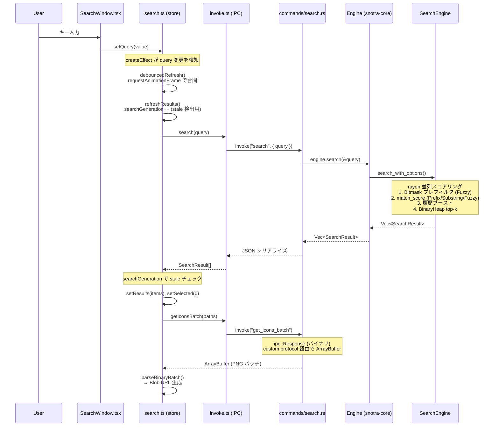

# アーキテクチャ

## プロジェクト概要

Snotra は Windows 専用のキーボードランチャー。バックエンドは Rust（Tauri v2）、フロントエンドは SolidJS + TypeScript で構築。システムトレイ/グローバルホットキー/IME などの Windows 固有機能は `windows` クレートで直接実装。グローバルホットキー（既定: `Alt+Q`）で検索ウィンドウを表示し、検索と起動を行う。

## ディレクトリ構成

```
Snotra/
  Cargo.toml              # workspace (snotra-core, src-tauri, snotra-settings)
  snotra-core/            # 純ロジック lib crate
  src-tauri/              # Tauri v2 バイナリ crate
  snotra-settings/        # egui 設定バイナリ（About タブ統合）
  ui/                     # SolidJS フロントエンド
  e2e/                    # E2E テスト
  package.json, vite.config.ts, tsconfig.json
```

Cargo ワークスペース構成で、純ロジックライブラリ（`snotra-core`）、Tauri バイナリ（`src-tauri`）、設定 GUI（`snotra-settings`）を分離。検索 UI は SolidJS + CSS 変数ベースのテーマシステムで Tauri IPC 経由で Rust バックエンドと通信。設定は egui ベースの別プロセスで（About 情報はタブとして統合）、`config.toml` ファイルを介して本体と連携する。

## レイヤー構成

```
┌───────────────────────────────────────────────────────┐
│  ui/ (SolidJS + TypeScript)                           │
│  components/ → stores/ → lib/invoke.ts                │
└────────────────────┬──────────────────────────────────┘
                     │ Tauri IPC (invoke / ipc::Response)
┌────────────────────▼──────────────────────────────────┐
│  src-tauri/ (Tauri v2 binary crate)                   │
│  commands/*  ←  state.rs (Mutex<Engine>)              │
│  platform/*  (Win32 message loop / hotkey / tray)     │
│  config_watcher / indexing / icon / monitor / ime     │
└────────────────────┬──────────────────────────────────┘
                     │ Rust 関数呼び出し
┌────────────────────▼──────────────────────────────────┐
│  snotra-core/ (pure-logic lib crate)                  │
│  Engine ← SearchEngine / HistoryStore / Config        │
│  indexer / folder / query / instant / binfmt          │
└───────────────────────────────────────────────────────┘

┌───────────────────────────────────────────────────────┐
│  snotra-settings/ (egui standalone binary)            │
│  app.rs (draft/saved model) → tabs/*                  │
│  通信: config.toml ファイル経由のみ（IPC なし）       │
└───────────────────────────────────────────────────────┘
```

## 各クレート・パッケージの詳細

### snotra-core（純ロジック層）

Win32 依存なし（`#[cfg(windows)]` ゲート以外）、完全にユニットテスト可能。UI 表示文字列を持たない（エラー状態は `is_error: true` フラグで伝え、表示文字列は UI 層が決める）。

| モジュール | 責務 |
|---|---|
| `engine.rs` | ファサード。`SearchEngine` + `HistoryStore` + `Config` を統合し、検索・履歴記録・フォルダ列挙・インデックスホットスワップを提供 |
| `search.rs` | 多段ランク付き検索（Prefix / Substring / Kana / Fuzzy / Path）。履歴ブースト、インクリメンタル検索キャッシュ、rayon 並列スコアリング |
| `indexer.rs` | ファイルシステムスキャン。拡張子フィルタ、正規化キーによる重複排除、インデックスキャッシュ（v3/v4）の保存/復元 |
| `config.rs` | `config.toml` の読み書き、デフォルト補完、レガシーフィールドの `apply_migrations()`、バリデーション |
| `history.rs` | グローバル起動回数・クエリ別選択回数・フォルダ展開回数の管理。バイナリ永続化（V1→V2→V3 フォールバック） |
| `folder.rs` | ディレクトリ列挙、フィルタ/ソート（フォルダ優先 → 展開回数降順 → 名前昇順）、top-k 返却 |
| `query.rs` | クエリ正規化（小文字化・アクセント折畳み・空白統一）、かな変換、文字ビットマスク計算 |
| `instant.rs` | インスタントコマンドの変数展開（`{query}` / `{clip}`）と前方一致フィルタリング |
| `binfmt.rs` | バージョン付きバイナリファイル I/O（magic + version ヘッダ、tmp → rename の原子的保存） |
| `ui_types.rs` | IPC データ型（`SearchResult`, `FolderExpansionState`） |
| `window_data.rs` | ウィンドウ位置の保存/復元（v5: モニター相対座標） |
| `error.rs` | エラー型定義（`BinError`, `ConfigError`） |

主要な型: `Engine`（全操作の入口）、`AppEntry`（インデックスエントリ）、`SearchResult`（検索結果 DTO）、`Config`（設定）、`PrebuiltIndex`（ロック外で構築→スワップ）、`FolderListContext`（スナップショットパターン）

### src-tauri（Tauri v2 バイナリ層）

| モジュール | 責務 |
|---|---|
| `main.rs` | Tauri アプリエントリポイント。イベントループ設定、コマンド登録、リスナー接続 |
| `state.rs` | `AppState`（`Mutex<Engine>` + `indexing` / `index_build_started` / `main_visible` の AtomicBool） |
| `icon.rs` | `SHGetFileInfoW` → HICON → BGRA → PNG パイプラインでアイコン抽出。遅延ロード＋キャッシュ永続化 |
| `indexing.rs` | バックグラウンドインデックス構築タスク。`indexing-started` / `indexing-complete` イベント発火 |
| `config_watcher.rs` | `notify` で `config.toml` を監視（100ms デバウンス）。差分検知 → ホットキー/トレイ/テーマ/言語等をホットリロード |
| `ime.rs` | Win32 IMM ラッパー（`ImmSetOpenStatus(false)`） |
| `monitor.rs` | マルチモニター Win32 ヘルパー（物理ピクセル座標）。作業領域取得・クランプ・中央配置 |

**commands/**（Tauri IPC コマンドハンドラ、責務別分割）:

| モジュール | 責務 |
|---|---|
| `search.rs` | 検索クエリ実行 |
| `launch.rs` | アイテム起動（ファイル・URL・ツール）。`launch_item_core`（`ShellExecuteW` + COM STA）を内部共有 |
| `config.rs` | 設定読み書き（bootstrap payload 含む） |
| `icon.rs` | バッチアイコン取得。`ipc::Response` でバイナリ返却、rayon 並列処理 |
| `window.rs` | ウィンドウ表示/非表示制御、`snotra-settings` 子プロセス管理（`SettingsProcessState`） |
| `system.rs` | システムレベルコマンド（再インデックス等） |
| `instant.rs` | インスタントコマンドの展開・フィルタリング（クリップボード読み取り + ShellExecuteW） |
| `updater.rs` | `restart_app`（フロントエンドの `downloadAndInstall()` 完了後に呼び出し） |

**platform/**（Win32 ネイティブ統合）:

| モジュール | 責務 |
|---|---|
| `mod.rs` | Win32 メッセージポンプスレッド。`WM_HOTKEY` / トレイメッセージを Tauri イベントへルーティング |
| `hotkey.rs` | `RegisterHotKey` / `UnregisterHotKey` によるグローバルホットキー管理 |
| `tray.rs` | `Shell_NotifyIconW` によるシステムトレイアイコン管理。クリック/コンテキストメニューイベント処理 |
| `wndproc.rs` | カスタム `DefWindowProc`。`WM_TRAY_ICON` / `WM_CONTEXTMENU` を `PostThreadMessageW` で再キューイング |

### ui（SolidJS フロントエンド）

```
ui/src/
  main.tsx             # ブートストラップ（テーマ適用・位置復元・イベントリスナー登録）
  MainApp.tsx          # ルートコンポーネント（SearchWindow + ResultsSection + UpdateToast 合成、動的高さ管理）
  components/          # UI コンポーネント
  stores/              # リアクティブ状態ストア
  lib/                 # 純ロジック・ユーティリティ（ストア非依存、テスト容易）
  styles/              # CSS
```

**components/**:

| ファイル | 責務 |
|---|---|
| `SearchWindow.tsx` | 検索入力フィールド。キーボードナビゲーション、スラッシュコマンド補完、ドラッグ移動 |
| `ResultsSection.tsx` | 検索結果のインライン表示。バッチアイコン取得、Blob URL ライフサイクル管理、スクロール追従 |
| `ResultRow.tsx` | 結果行（アイコン + 名前 + パス + フォルダバッジ） |
| `UpdateToast.tsx` | 自動更新通知トースト（任意の「今すぐ更新」ボタン付き） |
| `ToggleSwitch.tsx` | 汎用トグルスイッチコントロール |
| `ThemePreview.tsx` | `VisualConfig` からの縮小プレビュー |
| `SettingRow.tsx` | 設定行レイアウト（ラベル + 説明 + コントロールスロット） |

**stores/**:

| ファイル | 責務 |
|---|---|
| `search.ts` | 中央検索状態（query, results, selected, modes）。`resetForShow()`, `refreshResults()`, `initIndexingState()` |
| `folder.ts` | フォルダ展開状態。`FolderFrame` シグナル、`folderFilter` |
| `tool-selection.ts` | ツール選択状態。`ToolSelectionFrame` シグナル |

**lib/**:

| ファイル | 責務 |
|---|---|
| `invoke.ts` | 型安全な Tauri IPC ラッパー |
| `types.ts` | TypeScript 型定義（単一ソース） |
| `theme.ts` | CSS カスタムプロパティによるテーマ適用 |
| `i18n.ts` | 日英2言語翻訳。`t(key, params?)` + SolidJS シグナルで言語切替 |
| `commands.ts` | スラッシュコマンド定義（`/r`, `/o`, `/s`, `/q`）と `findCommand()` |
| `folderNav.ts` | フォルダナビゲーション純ロジック（親ディレクトリ計算、ドライブルート / UNC 対応） |
| `hotkeyValidation.ts` | ホットキー妥当性チェック（システムショートカット競合ガード） |
| `iconBatch.ts` | バイナリバッチアイコンペイロードのパース → パス別 Blob URL 生成 |
| `lruIconCache.ts` | アイコン Blob URL の LRU キャッシュ（自動 `revokeObjectURL`） |
| `truncatePath.ts` | Canvas ベースのピクセル幅計測による長パスの中間省略（結果キャッシュ付き） |
| `windowHeight.ts` | 結果件数とトースト有無からウィンドウ高さを計算 |
| `perf.ts` | 開発用パフォーマンス計測（`localStorage.snotra_perf=1` で有効化） |
| `trace.ts` | 開発用トレースログ（`localStorage.snotra_trace=1` で有効化） |

### snotra-settings（egui 設定 GUI）

独立バイナリ。本体との通信は `config.toml` ファイル経由のみ（IPC なし）。

| モジュール | 責務 |
|---|---|
| `main.rs` | エントリポイント。CLI 引数（`--first-run`, `--tab`）パース、`Config` ロード |
| `app.rs` | `eframe::App` 実装（`SettingsApp`）。draft/saved 二重状態モデル、タブルーティング、サイドバーキーボードナビゲーション、Save/Discard/Reset、ダーティインジケーター |
| `font.rs` | 日本語フォント読み込み（Yu Gothic → MS Gothic → Meiryo フォールバック）、システムフォントファミリー列挙 |
| `hotkey_input.rs` | ホットキーキャプチャウィジェット。修飾キー + メインキーの組み合わせを取得、システムショートカット即時拒否 |
| `i18n.rs` | `Tr(Language)` 翻訳構造体。match ベースで全 UI 文字列の日英切替 |

**tabs/**（設定タブ、サイドバー順）:

| ファイル | 責務 |
|---|---|
| `general.rs` | 言語・ホットキー・動作トグル（起動時表示/トレイ/IME/自動非表示/カーソルモニター追従）・自動更新モード |
| `search.rs` | 検索方式（通常/フォルダ展開別）・隠しファイル表示・PATH 検索・履歴件数・履歴正規化・ローマ字検索 |
| `index.rs` | スキャンパス一覧（パス + 拡張子 + フォルダ含む）。モーダルでの追加/編集、非同期フォルダピッカー |
| `visual.rs` | テーマプリセット（Obsidian / Paper / Solarized / Monokai / Custom）・色設定・フォント・表示件数・幅・アイコン表示 |
| `opener.rs` | オープナールール一覧（具体度順自動ソート）。ルール/ツールの追加/編集/削除/並べ替え、プリセット検出 |
| `instant.rs` | インスタントコマンドのプレフィックス設定・コマンド追加/編集/削除/複製（変数展開プレビュー付き） |
| `backup.rs` | config.toml のエクスポート/インポート（TOML バリデーション + マイグレーション）・設定フォルダを開く |

## 横断的な実装パターン

### ウィンドウ管理

- 検索ウィンドウは起動時に作成し `visible: false`、ホットキーで表示/非表示を切替
- 検索バーと検索結果は単一ウィンドウ内のコンポーネント（`SearchWindow` + `ResultsSection`）
- 結果の表示/非表示は `shouldShowResults` メモシグナル（`results().length > 0 && (!indexing() || instantCommandMode())`）で制御
- ウィンドウ高さは `createEffect` + Tauri `set_size()` で動的に変更。Rust 側の `show_main_and_emit` で毎回 52px にリセットしてからフロントエンドが結果に応じて拡張する
- マルチモニター: モニター作業領域原点からの相対座標（物理ピクセル）で位置を保存。ホットキー押下時にターゲットモニターを決定し絶対座標に変換

### 起動シーケンスと初期化順序

- `platform/mod.rs` の Win32 メッセージループスレッドはウィンドウ生成より前に spawn し、Win32 初期化とウィンドウ生成を並列実行（起動時間短縮）
- トレイアイコンの表示はウィンドウ生成完了後に行う
- ホットキー登録（`RegisterHotKey`）は `hotkey-pressed` イベントリスナーの登録完了後に行う（「有効化 ≥ リスナー登録」不変条件）
- 起動時 UI 初期化は `get_bootstrap_payload` で `visual` / `auto_hide_on_focus_lost` / `indexing` / `language` を一括取得
- フロントエンドは bootstrap 到着前のフラッシュ防止のため `navigator.language` から同期的に初期言語を決定

### 設定管理

- 設定は `snotra-settings.exe` を子プロセスとして起動。相互依存は `config.toml` ファイル1点のみ（IPC 不要）
- 本体は `notify` クレートで `config.toml` 変更を検知し即時反映する
- 子プロセス管理: `Mutex<Option<Child>>` で保持。起動時に重複チェック、監視スレッドで終了検知 + `alwaysOnTop` 復元、exit ハンドラで kill
- `snotra-settings` の設定編集は draft/saved 二重状態モデル（Save 時にのみ `config.toml` に書き込み）

### データ永続化

- 履歴/インデックス/アイコン/ウィンドウ位置は `.tmp` を使った原子的書き込み
- `%APPDATA%\Snotra\` にファイル分割保存: `index.bin`, `icons.bin`, `history.bin`, `window.bin`, `config.toml`
- バイナリファイルは先頭に `magic + u32 version` ヘッダ。読み込みはバージョンフォールバック
- アイコンは検索時にオンデマンドで抽出し PNG バイト列としてキャッシュ。`icons.bin` は初回アイコン取得時に遅延ロード

### アイコンパイプライン

- `SHGetFileInfoW` → HICON → BGRA → PNG で抽出（base64 エンコードなし）
- フロントエンドへは `tauri::ipc::Response` でバイナリ IPC（`get_icons_batch`）
- バッチ形式: `[count:u32 LE]` + 各アイコン `[status:u8][png_len:u32 LE][png_bytes]`
- フロントエンド側は `parseBinaryBatch()` → `URL.createObjectURL(new Blob(...))` で `` に渡す
- `LruIconCache` で Blob URL を管理し、自動 `revokeObjectURL` でメモリリーク防止
- CSP の `connect-src` に `ipc: http://ipc.localhost` が必須（リリースビルドで必要）

### 多言語対応（3層）

- フロントエンド: `ui/src/lib/i18n.ts` — SolidJS シグナル + 翻訳テーブル（`t(key, params?)` + `{param}` プレースホルダ置換）
- バックエンド: `config_watcher.rs` — `language-changed` イベント発火 + `PlatformCommand::SetLanguage` でトレイ切替
- 設定 GUI: `snotra-settings/src/i18n.rs` — `Tr` 構造体の match ベース翻訳
- 初期言語は OS 設定から自動判定（Rust: `sys-locale`、JS: `navigator.language`、同一ロジック: `ja` で始まれば日本語、それ以外は英語）

### インスタントコマンド（4層）

- 純ロジック: `snotra-core/src/instant.rs` — 変数展開 `{query}` / `{clip}` + 前方一致フィルタ。URL 判定で自動 URL エンコード
- IPC: `src-tauri/src/commands/instant.rs` — クリップボード読み取り + `launch_item_core`（ShellExecuteW）で実行
- UI: `ui/src/stores/search.ts` — `instantCommandMode` シグナル + query effect でモード切替。indexing 中でも使用可能
- 設定 GUI: `snotra-settings/src/tabs/instant.rs` — プレフィックス設定 + コマンド CRUD + 展開プレビュー
- プレフィックス変更は `config_watcher.rs` が `instant-prefix-changed` イベントで UI に通知

### カスタムオープナー

- `config.toml` の `[[openers]]` でルール定義（`target` + `tools`）
- 全起動経路で統一適用（通常 Enter / Shift+Enter / クリック / トレイ履歴メニュー）
- 最具体ルール1つだけ採用（排他）。具体度 = パス条件の長さ
- Shift+Enter でツール選択メニュー表示（2件以上の場合）
- ツール引数: 固定引数 + パス末尾付加。`{path}` プレースホルダ対応

### 自動更新

- `tauri-plugin-updater` で GitHub Releases 経由
- 3モード: `full`（トースト + インストールボタン）/ `check_only`（通知のみ）/ `disabled`
- トースト UI は検索バーと結果リストの間に 52px で表示
- リリース形式: ポータブル ZIP + NSIS インストーラー

### その他のパターン

- フォルダ展開は「開始時スナップショットを保持し、`Escape` で一括復帰」モデル
- テーマは CSS カスタムプロパティで動的に切替（`document.documentElement.style.setProperty()`）
- `launch_item` は `LaunchResult(status/code/message)` を返す契約。失敗通知の自動クリアは単一タイマーを再利用して競合防止
- 隣接バイナリ（`snotra-settings.exe`）を追加・変更した場合は `release.yml` のビルドステップと artifact 検証ステップの確認が必要

## 検索フロー（入力 → 結果表示）



**補足**:
- `searchGeneration` は検索リクエストごとにインクリメントされるカウンタ。応答が返ったとき現在値と比較し、古いレスポンスを破棄する
- アイコンは `ipc::Response` でバイナリ返却するため、CSP の `connect-src` に `ipc: http://ipc.localhost` が必須（`tauri dev` では不要だがリリースビルドで必要）

## 状態遷移（概要）

```
LauncherStopped → Standby → SearchVisible
                              ├── NormalMode
                              ├── CommandMode (/コマンド入力)
                              ├── InstantCommandMode (@プレフィックス入力)
                              ├── FolderExpansionMode (ArrowRight/Left)
                              ├── ToolSelectionMode (Shift+Enter)
                              └── IndexingMode (構築中)
```

- `Escape` は内側のモードから順に復帰（ToolSelection → FolderExpansion → NormalMode → Standby）
- `snotra-settings` は子プロセスとして起動され、本体の状態遷移には影響しない
- 詳細な遷移ルールは `SPEC.md` §8.6 を参照

## 参照先

- 意図（仕様）: `SPEC.md`
- 設定値・デフォルト: `snotra-core/src/config.rs`
- パフォーマンス最適化: `PERFORMANCE.md`
- モジュール詳細: 各サブディレクトリの `CLAUDE.md`
