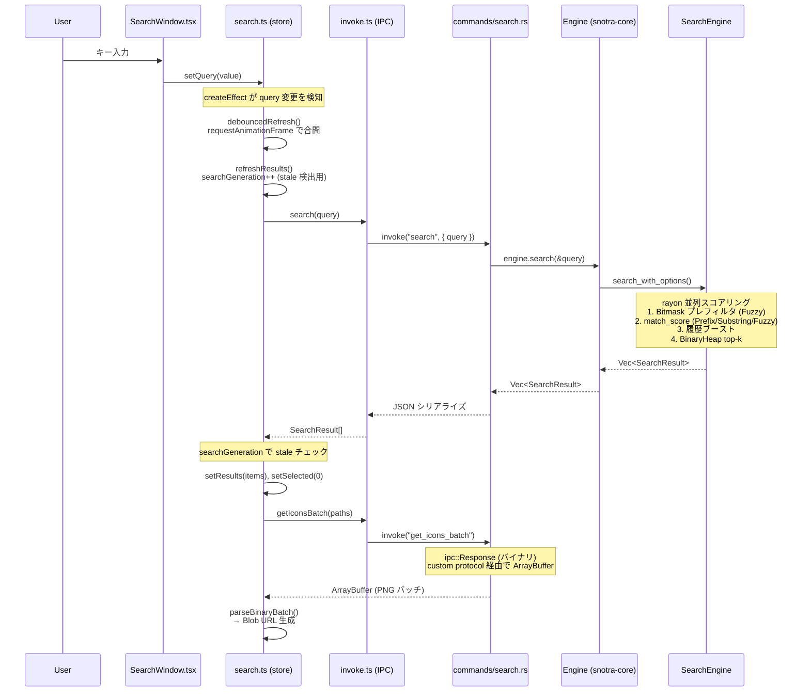

# アーキテクチャ

## プロジェクト概要

Snotra は Windows 専用のキーボードランチャー。バックエンドは Rust（Tauri v2）、フロントエンドは SolidJS + TypeScript で構築。システムトレイ/グローバルホットキー/IME などの Windows 固有機能は `windows` クレートで直接実装。グローバルホットキー（既定: `Alt+Q`）で検索ウィンドウを表示し、検索と起動を行う。

## ディレクトリ構成

```
Snotra/
  Cargo.toml              # workspace (snotra-core, src-tauri, snotra-settings)
  snotra-core/            # 純ロジック lib crate
  src-tauri/              # Tauri v2 バイナリ crate
  snotra-settings/        # egui 設定バイナリ（About タブ統合）
  ui/                     # SolidJS フロントエンド
  e2e/                    # E2E テスト
  package.json, vite.config.ts, tsconfig.json
```

Cargo ワークスペース構成で、純ロジックライブラリ（`snotra-core`）、Tauri バイナリ（`src-tauri`）、設定 GUI（`snotra-settings`）を分離。検索 UI は SolidJS + CSS 変数ベースのテーマシステムで Tauri IPC 経由で Rust バックエンドと通信。設定は egui ベースの別プロセスで（About 情報はタブとして統合）、`config.toml` ファイルを介して本体と連携する。

## レイヤー構成

```
┌───────────────────────────────────────────────────────┐
│  ui/ (SolidJS + TypeScript)                           │
│  components/ → stores/ → lib/invoke.ts                │
└────────────────────┬──────────────────────────────────┘
                     │ Tauri IPC (invoke / ipc::Response)
┌────────────────────▼──────────────────────────────────┐
│  src-tauri/ (Tauri v2 binary crate)                   │
│  commands/*  ←  state.rs (Mutex<Engine>)              │
│  platform/*  (Win32 message loop / hotkey / tray)     │
│  config_watcher / indexing / icon / monitor / ime     │
└────────────────────┬──────────────────────────────────┘
                     │ Rust 関数呼び出し
┌────────────────────▼──────────────────────────────────┐
│  snotra-core/ (pure-logic lib crate)                  │
│  Engine ← SearchEngine / HistoryStore / Config        │
│  indexer / folder / query / instant / binfmt          │
└───────────────────────────────────────────────────────┘

┌───────────────────────────────────────────────────────┐
│  snotra-settings/ (egui standalone binary)            │
│  app.rs (draft/saved model) → tabs/*                  │
│  通信: config.toml ファイル経由のみ（IPC なし）       │
└───────────────────────────────────────────────────────┘
```

## 各クレート・パッケージの詳細

ファイル単位のモジュール構成と各モジュールの責務は、各サブディレクトリの `CLAUDE.md` を SSOT とする（このセクションでは重複させない）。ここでは各クレート・パッケージの位置づけと主要な型のみを記す。

### snotra-core（純ロジック層）

Win32 依存なし（`#[cfg(windows)]` ゲート以外）、完全にユニットテスト可能。UI 表示文字列を持たない（エラー状態は `is_error: true` フラグで伝え、表示文字列は UI 層が決める）。多段ランク付き検索・履歴ブースト・インデックスキャッシュ・バイナリ永続化を担う純ロジック lib crate。

主要な型: `Engine`（全操作の入口）、`AppEntry`（インデックスエントリ）、`SearchResult`（検索結果 DTO）、`Config`（設定）、`PrebuiltIndex`（ロック外で構築→スワップ）、`FolderListContext`（スナップショットパターン）

→ モジュール構成は `snotra-core/CLAUDE.md`

### src-tauri（Tauri v2 バイナリ層）

Tauri v2 バイナリ crate（パッケージ名 `snotra`）。Win32 API 統合（システムトレイ・グローバルホットキー・IME・マルチモニター）とフロントエンドとの IPC を担当。`commands/` は責務別に分割した `#[tauri::command]` ハンドラ群、`platform/` は Win32 メッセージループ・ホットキー・トレイのネイティブ統合。

→ モジュール構成は `src-tauri/CLAUDE.md`

### ui（SolidJS フロントエンド）

```
ui/src/
  main.tsx             # ブートストラップ（テーマ適用・位置復元・イベントリスナー登録）
  MainApp.tsx          # ルートコンポーネント（SearchWindow + ResultsSection + UpdateToast 合成、動的高さ管理）
  components/          # UI コンポーネント
  stores/              # リアクティブ状態ストア
  lib/                 # 純ロジック・ユーティリティ（ストア非依存、テスト容易）
  styles/              # CSS
```

**components/** は描画、**stores/** はリアクティブ状態、**lib/** はストア非依存の純ロジック・ユーティリティ。Tauri IPC は `lib/invoke.ts` の型付きラッパー経由。

→ モジュール構成は `ui/CLAUDE.md`

### snotra-settings（egui 設定 GUI）

独立バイナリ。本体との通信は `config.toml` ファイル経由のみ（IPC なし）。`app.rs` の draft/saved 二重状態モデルを核に、`tabs/` のタブ式設定エディタを構成する egui アプリ。

→ モジュール構成は `snotra-settings/CLAUDE.md`

## 横断的な実装パターン

### ウィンドウ管理

- 検索ウィンドウは起動時に作成し `visible: false`、ホットキーで表示/非表示を切替
- 検索バーと検索結果は単一ウィンドウ内のコンポーネント（`SearchWindow` + `ResultsSection`）
- 結果の表示/非表示は `shouldShowResults` メモシグナル（`results().length > 0 && (!indexing() || interpKind() === "instant")`）で制御
- ウィンドウ高さは `createEffect` + Tauri `set_size()` で動的に変更。Rust 側の `show_main_and_emit` で毎回 52px にリセットしてからフロントエンドが結果に応じて拡張する
- マルチモニター: モニター作業領域原点からの相対座標（物理ピクセル）で位置を保存。ホットキー押下時にターゲットモニターを決定し絶対座標に変換

### 起動シーケンスと初期化順序

- `platform/mod.rs` の Win32 メッセージループスレッドはウィンドウ生成より前に spawn し、Win32 初期化とウィンドウ生成を並列実行（起動時間短縮）
- トレイアイコンの表示はウィンドウ生成完了後に行う
- ホットキー登録（`RegisterHotKey`）は `hotkey-pressed` イベントリスナーの登録完了後に行う（「有効化 ≥ リスナー登録」不変条件）
- 起動時 UI 初期化は `get_bootstrap_payload` で `visual` / `auto_hide_on_focus_lost` / `indexing` / `language` を一括取得
- フロントエンドは bootstrap 到着前のフラッシュ防止のため `navigator.language` から同期的に初期言語を決定

### 設定管理

- 設定は `snotra-settings.exe` を子プロセスとして起動。相互依存は `config.toml` ファイル1点のみ（IPC 不要）
- 本体は `notify` クレートで `config.toml` 変更を検知し即時反映する
- 子プロセス管理: `Mutex<Option<Child>>` で保持。起動時に重複チェック、監視スレッドで終了検知 + `alwaysOnTop` 復元、exit ハンドラで kill
- `snotra-settings` の設定編集は draft/saved 二重状態モデル（Save 時にのみ `config.toml` に書き込み）
- **config↔派生状態のコヒーレンシ**: config 由来の派生状態は「live-read（毎操作で読み直し＝即時整合）」と「構築時焼き込み（要再構築）」の 2 種。後者の中核 `SearchEngine`（index）の整合は engine の `index_stale` ledger が所有し、`config_watcher` が `IndexInputs` 差分で `start_index_build` を kick → ロック外ビルド → `complete_index_drain` の re-diff で stale をクリアする（ビルド進行中の設定変更も取りこぼさない）。`HistoryStore` の剪定容量は live-read 化しキャッシュを持たない。詳細は `docs/design/2026-05-31-coherence-staleset.md`（StaleSet 契約）

### データ永続化

- 履歴/インデックス/アイコン/ウィンドウ位置は `.tmp` を使った原子的書き込み
- `%APPDATA%\Snotra\` にファイル分割保存: `index.bin`, `icons.bin`, `history.bin`, `window.bin`, `config.toml`
- バイナリファイルは先頭に `magic + u32 version` ヘッダ。読み込みはバージョンフォールバック
- アイコンは検索時にオンデマンドで抽出し PNG バイト列としてキャッシュ。`icons.bin` は初回アイコン取得時に遅延ロード

### アイコンパイプライン

- `SHGetFileInfoW` → HICON → BGRA → PNG で抽出（base64 エンコードなし）
- フロントエンドへは `tauri::ipc::Response` でバイナリ IPC（`get_icons_batch`）
- バッチ形式: `[count:u32 LE]` + 各アイコン `[status:u8][png_len:u32 LE][png_bytes]`
- フロントエンド側は `parseBinaryBatch()` → `URL.createObjectURL(new Blob(...))` で `` に渡す
- `LruIconCache` で Blob URL を管理し、自動 `revokeObjectURL` でメモリリーク防止
- CSP の `connect-src` に `ipc: http://ipc.localhost` が必須（リリースビルドで必要）

### 多言語対応（3層）

- フロントエンド: `ui/src/lib/i18n.ts` — SolidJS シグナル + 翻訳テーブル（`t(key, params?)` + `{param}` プレースホルダ置換）
- バックエンド: `config_watcher.rs` — `language-changed` イベント発火 + `PlatformCommand::SetLanguage` でトレイ切替
- 設定 GUI: `snotra-settings/src/i18n.rs` — `Tr` 構造体の match ベース翻訳
- 初期言語は OS 設定から自動判定（Rust: `sys-locale`、JS: `navigator.language`、同一ロジック: `ja` で始まれば日本語、それ以外は英語）

### インスタントコマンド（4層）

- 純ロジック: `snotra-core/src/instant.rs` — 変数展開 `{query}` / `{clip}` / `{date:書式}` / `{uuid}`（修飾子パイプ `{name | lower|upper|trim|default:x|raw}` 対応）+ 前方一致フィルタ。date は strftime（不正書式は空文字でフォールバック＝panic 回避）、uuid は v4。エンコードはシンク（種別）責務で URL 判定時に自動付与、`raw` で抑止。不明修飾子は `Config::validate` が保存時に拒否
- IPC: `src-tauri/src/commands/instant.rs` — クリップボード読み取り + `launch_item_core`（ShellExecuteW）で実行
- UI: `ui/src/stores/search.ts` — `interpKind()`（`query` + prefix からの純粋導出）でモード判定。query effect が instant コマンドの IPC 取得（getInstantCommands）を担う。indexing 中でも使用可能
- 設定 GUI: `snotra-settings/src/tabs/instant.rs` — プレフィックス設定 + コマンド CRUD + 展開プレビュー
- プレフィックス変更は `config_watcher.rs` が `instant-prefix-changed` イベントで UI に通知

### カスタムオープナー

- `config.toml` の `[[openers]]` でルール定義（`target` + `tools`）
- 全起動経路で統一適用（通常 Enter / Shift+Enter / クリック / トレイ履歴メニュー）
- 最具体ルール1つだけ採用（排他）。具体度 = パス条件の長さ
- Shift+Enter でツール選択メニュー表示（2件以上の場合）
- ツール引数: 固定引数 + パス末尾付加。`{path}` プレースホルダ対応

### 自動更新

- `tauri-plugin-updater` で GitHub Releases 経由
- 3モード: `full`（トースト + インストールボタン）/ `check_only`（通知のみ）/ `disabled`
- トースト UI は検索バーと結果リストの間に 52px で表示
- リリース形式: ポータブル ZIP + NSIS インストーラー

### その他のパターン

- フォルダ展開は「開始時スナップショットを保持し、`Escape` で一括復帰」モデル
- テーマは CSS カスタムプロパティで動的に切替（`document.documentElement.style.setProperty()`）
- `launch_item` は `LaunchResult(status/code/message)` を返す契約。失敗通知の自動クリアは単一タイマーを再利用して競合防止
- 隣接バイナリ（`snotra-settings.exe`）を追加・変更した場合は `release.yml` のビルドステップと artifact 検証ステップの確認が必要

## 検索フロー（入力 → 結果表示）



**補足**:
- `searchGeneration` は検索リクエストごとにインクリメントされるカウンタ。応答が返ったとき現在値と比較し、古いレスポンスを破棄する
- アイコンは `ipc::Response` でバイナリ返却するため、CSP の `connect-src` に `ipc: http://ipc.localhost` が必須（`tauri dev` では不要だがリリースビルドで必要）

## 状態遷移（概要）

```
LauncherStopped → Standby → SearchVisible
                              ├── NormalMode
                              ├── CommandMode (/コマンド入力)
                              ├── InstantCommandMode (@プレフィックス入力)
                              ├── FolderExpansionMode (ArrowRight/Left)
                              ├── ToolSelectionMode (Shift+Enter)
                              └── IndexingMode (構築中)
```

- `Escape` は内側のモードから順に復帰（ToolSelection → FolderExpansion → NormalMode → Standby）
- `snotra-settings` は子プロセスとして起動され、本体の状態遷移には影響しない
- 詳細な遷移ルールは `SPEC.md` §8.6 を参照

## 参照先

- 意図（仕様）: `SPEC.md`
- 設定値・デフォルト: `snotra-core/src/config.rs`
- パフォーマンス最適化: `PERFORMANCE.md`
- モジュール詳細: 各サブディレクトリの `CLAUDE.md`
- config↔派生状態コヒーレンシ設計（StaleSet 契約）: `docs/design/2026-05-31-coherence-staleset.md`
