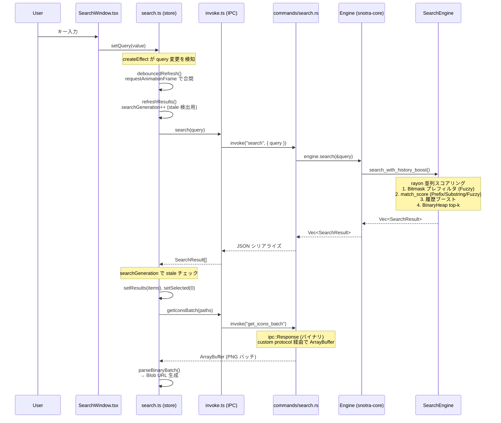

# アーキテクチャ

## プロジェクト概要

Snotra は Windows 専用のキーボードランチャー。バックエンドは Rust（Tauri v2）、フロントエンドは SolidJS + TypeScript で構築。システムトレイ/グローバルホットキー/IME などの Windows 固有機能は `windows` クレートで直接実装。グローバルホットキー（既定: `Alt+Q`）で検索ウィンドウを表示し、検索と起動を行う。

## ディレクトリ構成

```
Snotra/
  Cargo.toml              # workspace (snotra-core, src-tauri, snotra-settings)
  snotra-core/            # 純ロジック lib crate
  src-tauri/              # Tauri v2 バイナリ crate
  snotra-settings/        # egui 設定バイナリ（About タブ統合）
  ui/                     # SolidJS フロントエンド
  package.json, vite.config.ts, tsconfig.json
```

Cargo ワークスペース構成で、純ロジックライブラリ（`snotra-core`）、Tauri バイナリ（`src-tauri`）、設定 GUI（`snotra-settings`）を分離。検索 UI は SolidJS + CSS 変数ベースのテーマシステムで Tauri IPC 経由で Rust バックエンドと通信。設定は egui ベースの別プロセスで（About 情報はタブとして統合）、`config.toml` ファイルを介して本体と連携する。

## 横断的な実装パターン

- 検索ウィンドウは起動時に作成し `visible: false`、ホットキーで表示/非表示を切替
- フォルダ展開は「開始時スナップショットを保持し、`Escape` で一括復帰」モデル
- 履歴/インデックス/アイコン保存は `.tmp` を使った原子的書き込み
- アイコンは検索時にオンデマンドで抽出し base64 PNG としてフロントエンドに送信、キャッシュは終了時に永続化
- テーマは CSS カスタムプロパティで動的に切替
- 多言語対応は3層で実装: フロントエンド（`ui/src/lib/i18n.ts` — SolidJS シグナル + 翻訳テーブル）、バックエンド（`config_watcher.rs` — `language-changed` イベント発火 + `PlatformCommand::SetLanguage` でトレイ切替）、設定 GUI（`snotra-settings/src/i18n.rs` — `Tr` 構造体の match ベース翻訳）。初期言語は OS 設定から自動判定（Rust: `sys-locale`、JS: `navigator.language`、同一ロジック）
- 検索バーと検索結果は単一ウィンドウ内のコンポーネント（`SearchWindow` + `ResultsSection`）。結果の表示/非表示は `shouldShowResults` メモシグナル（`results().length > 0 && (!indexing() || instantCommandMode())`）で制御し、ウィンドウ高さは `createEffect` + Tauri `set_size()` で動的に変更する。Rust 側の `show_main_and_emit` で毎回 52px にリセットしてからフロントエンドが結果に応じて拡張する
- インスタントコマンドはプレフィックス（デフォルト `@`）で始まる入力でユーザー定義コマンドを即座に実行する機能。4層で実装: 純ロジック（`snotra-core/src/instant.rs` — 変数展開 `{query}`/`{clip}` + 前方一致フィルタ）、IPC（`src-tauri/src/commands/instant.rs` — クリップボード読み取り + ShellExecuteW）、UI（`ui/src/stores/search.ts` — `instantCommandMode` シグナル + query effect でモード切替）、設定 GUI（`snotra-settings/src/tabs/instant.rs`）。プレフィックス変更は `config_watcher.rs` が `instant-prefix-changed` イベントで UI に通知する
- `launch_item` は `LaunchResult(status/code/message)` を返す契約で扱い、失敗通知の自動クリアは単一タイマーを再利用して競合を防ぐ
- 起動時にスレッドを並列 spawn する場合、そのスレッドが発火するイベントに依存する機能（ホットキー・トレイ等）はスレッド init フェーズで有効化せず、main 側でリスナー/ウィンドウ準備が整った後にコマンド（`RegisterInitialHotkey` / `SetTrayVisible`）で有効化する（「有効化 ≥ リスナー登録」不変条件）
- 設定は `snotra-settings.exe` を子プロセスとして起動する（About 情報はタブに統合）。相互依存は `config.toml` ファイル1点のみ（IPC 不要）。本体は `notify` クレートで config.toml 変更を検知し即時反映する
- 子プロセス管理: `Mutex<Option<Child>>` で保持し、起動時に重複チェック、監視スレッドで終了検知 + alwaysOnTop 復元、exit ハンドラで kill。**子プロセスを spawn する場合は exit ハンドラでの kill を必ずペアで追加する**
- 子プロセスとして起動する外部バイナリ（`snotra-settings.exe` 等）は、Cargo ワークスペースの依存関係外にある場合リリースワークフローでビルドされない。**隣接バイナリを追加・変更した場合は `release.yml` のビルドステップと artifact 検証ステップを必ず確認する**
- `snotra-core`（純ロジック層）に UI 表示文字列を持たない。エラー状態の意味は `is_error: true` フラグで伝え、エラーメッセージのような表示文字列は UI 層（`ResultRow.tsx` 等）が決める責務を持つ

## 検索フロー（入力 → 結果表示）



**補足**:
- `searchGeneration` は検索リクエストごとにインクリメントされるカウンタ。応答が返ったとき現在値と比較し、古いレスポンスを破棄する
- アイコンは `ipc::Response` でバイナリ返却するため、CSP の `connect-src` に `ipc: http://ipc.localhost` が必須（`tauri dev` では不要だがリリースビルドで必要）

## 参照先

- 意図（仕様）: `SPEC.md`
- 設定値・デフォルト: `snotra-core/src/config.rs`
- パフォーマンス最適化: `PERFORMANCE.md`
- モジュール詳細: 各サブディレクトリの `CLAUDE.md`
