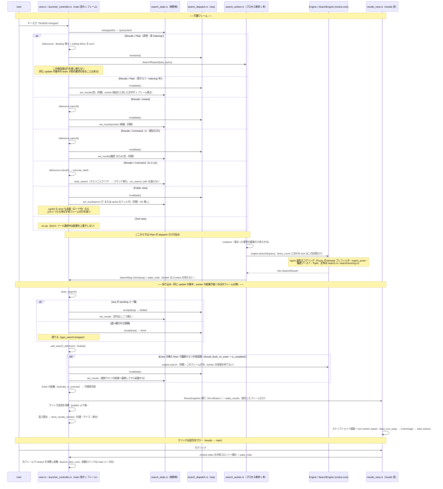

# アーキテクチャ

## プロジェクト概要

Snotra は Windows 専用のキーボードランチャー。全層 Rust（Tauri v2 ランタイム + egui/softbuffer 検索 UI・#532 で WebView2/SolidJS フロントを撤去）。システムトレイ/グローバルホットキー/IME などの Windows 固有機能は `windows` クレートで直接実装。グローバルホットキー（既定: `Alt+Q`）で検索ウィンドウを表示し、検索と起動を行う。

## ディレクトリ構成

```
Snotra/
  Cargo.toml              # workspace（製品 4 crate）
  snotra-core/            # 純ロジック lib crate
  snotra-egui-runtime/    # Tauri native Window向けegui/softbuffer接着層
  src-tauri/              # Tauri v2 バイナリ crate（egui_shell = 検索 UI）
  snotra-settings/        # egui 設定バイナリ（版数・About はサイドバー表示）
  package.json            # node（セーフティネット vitest + @tauri-apps/cli）
```

Cargo ワークスペース構成で、純ロジックライブラリ（`snotra-core`）、Tauri バイナリ（`src-tauri`）、設定 GUI（`snotra-settings`）を分離。検索 UI は `src-tauri/src/egui_shell/`（egui + `snotra-egui-runtime` の softbuffer CPU ラスタ）で、`Engine` を直接呼ぶ——IPC・TypeScript DTO は #532 SU7 で消滅した。設定は egui ベースの別プロセスで（版数・About 情報はサイドバーに表示）、`config.toml` ファイルを介して本体と連携する。

## レイヤー構成

```
┌───────────────────────────────────────────────────────┐
│  src-tauri/ (Tauri v2 binary crate)                   │
│  egui_shell/* (検索 UI・softbuffer) ← snotra-egui-runtime │
│  commands/* (共有 core 関数)  ←  state.rs (Mutex<Engine>) │
│  platform/*  (Win32 message loop / hotkey / tray)     │
│  config_watcher / indexing / icon / monitor / ime     │
└────────────────────┬──────────────────────────────────┘
                     │ Rust 関数呼び出し
┌────────────────────▼──────────────────────────────────┐
│  snotra-core/ (pure-logic lib crate)                  │
│  Engine ← SearchEngine / HistoryStore / Config        │
│  indexer / folder / query / instant / binfmt          │
└───────────────────────────────────────────────────────┘

┌───────────────────────────────────────────────────────┐
│  snotra-settings/ (egui standalone binary)            │
│  app.rs (draft/saved model) → tabs/*                  │
│  通信: config.toml ファイル経由のみ（IPC なし）       │
└───────────────────────────────────────────────────────┘
```

## 各クレート・パッケージの詳細

各モジュールの責務宣言は各ファイルの `//!`（Rust）/ TSDoc（TS）を正本とし、各サブディレクトリの `CLAUDE.md` はファイル名の索引と横断不変条件を持つ（#562。このセクションでは重複させない）。ここでは各クレート・パッケージの位置づけと主要な型のみを記す。

### snotra-core（純ロジック層）

Win32 依存なし（`#[cfg(windows)]` ゲート以外）、完全にユニットテスト可能。UI 表示文字列を持たない（エラー状態は `is_error: true` フラグで伝え、表示文字列は UI 層が決める）。多段ランク付き検索・履歴ブースト・インデックスキャッシュ・バイナリ永続化を担う純ロジック lib crate。

主要な型: `Engine`（全操作の入口）、`AppEntry`（インデックスエントリ）、`SearchResult`（検索結果 DTO）、`Config`（設定）、`PrebuiltIndex`（ロック外で構築→スワップ）、`FolderListContext`（スナップショットパターン）

→ モジュール構成は `snotra-core/CLAUDE.md`

### src-tauri（Tauri v2 バイナリ層）

Tauri v2 バイナリ crate（パッケージ名 `snotra`）。検索 UI（`egui_shell/`・egui + softbuffer）と Win32 API 統合（システムトレイ・グローバルホットキー・IME・マルチモニター）を担当。`commands/` は UI・トレイが共有する core 関数群（旧 IPC ハンドラは #532 SU7 で撤去・`LaunchResult` 契約等は残置）、`platform/` は Win32 メッセージループ・ホットキー・トレイのネイティブ統合。

→ モジュール構成は `src-tauri/CLAUDE.md`

### snotra-settings（egui 設定 GUI）

独立バイナリ。本体との通信は `config.toml` ファイル経由のみ（IPC なし）。`app.rs` の draft/saved 二重状態モデルを核に、`tabs/` のタブ式設定エディタを構成する egui アプリ。

→ モジュール構成は `snotra-settings/CLAUDE.md`

### snotra-egui-runtime（egui/softbuffer 接着層）

Tauri wry plugin で Tao イベントを受け、egui 入力・Win32 IME composition・repaint（`RequestRedraw` 配送の下限間隔＝フレーム上限。モニターのリフレッシュレート・取得失敗時 60Hz・#737）・softbuffer Surface の描画失敗リトライ（指数バックオフ・上限 5 回）を Window 単位で管理する接着層。`src-tauri` が唯一の消費者で、製品バイナリ `snotra.exe` に組み込まれて配布される（Issue #532 の採用判断に使った独立検証バイナリ `snotra-egui-mvp` は #660 で撤去済み）。

→ モジュール構成と制約は `snotra-egui-runtime/CLAUDE.md`

## 横断的な実装パターン

### ウィンドウ管理

- 検索ウィンドウ（`main`）と結果ウィンドウ（`results`）は起動時のセットアップで作成し `visible: false`、ホットキーで表示/非表示を切替（#646 PR2 で 2 窓構成へ）
- 検索バーは `main`、検索結果は `results`（`egui_shell/view.rs` / `egui_shell/results_view.rs`）に分離して描画する。`results` は `focusable(false)` でフォーカスを取らない従属窓
- 結果の表示/非表示は `search_state.rs` の純粋核（view 種別 = tool>folder>results の優先度射影 + indexing 表示ゲート）で制御
- `main` の高さは結果表示による伸縮はしない。`main` の高さは `egui_shell/view.rs` の毎フレーム処理が算出し自窓へ直接 `set_size` する。`results` の高さは `egui_shell/window_coordinator.rs` の driver が算出し `ResultsWindow::set_size` で適用する（旧 compute_window_height は撤去済み）。式は `src-tauri/src/egui_shell/layout.rs`（`main_window_height` / `results_window_height`）が正本、ユーザー観測面は `SPEC.md` §4.7「4.7 結果表示制御（2 窓構成）」（main）・`SPEC.md` §4.5「4.5 最大列挙数」（results）が正本。show 時に bar_height（`font_size + bar_padding`・既定 43px）へリセットする
- `results` の位置・可視性は `main` の毎フレーム更新（`drive_results_window`）が駆動する（`main` 直下 + `window_gap`・既定 4px）。両窓に DWM 角丸を適用（Windows 11 best-effort・Win10 は角丸なし）
- マルチモニター: モニター作業領域原点からの相対座標（物理ピクセル）で位置を保存。ホットキー押下時にターゲットモニターを決定し絶対座標に変換

### 起動シーケンスと初期化順序

- `platform/mod.rs` の Win32 メッセージループスレッドはウィンドウ生成より前に spawn し、Win32 初期化とウィンドウ生成を並列実行（起動時間短縮）
- トレイアイコンの表示はウィンドウ生成完了後に行う
- ホットキー登録（`RegisterHotKey`）は `hotkey-pressed` イベントリスナーの登録完了後に行う（「有効化 ≥ リスナー登録」不変条件）
- egui view は config を毎フレーム live-read するため bootstrap 一括取得は存在しない（#532 SU7 で IPC ごと撤去）

### 設定管理

- 設定は `snotra-settings.exe` を子プロセスとして起動。相互依存は `config.toml` ファイル1点のみ（IPC 不要）
- 本体は `notify` クレートで `config.toml` 変更を検知し即時反映する
- 子プロセス管理: `Mutex<Option<Child>>` で保持。起動時に重複チェック、監視スレッドで終了検知 + 最前面表示（`set_always_on_top`）の復元、exit ハンドラで kill
- `snotra-settings` の設定編集は draft/saved 二重状態モデル（Save 時にのみ `config.toml` に書き込み）
- **config↔派生状態のコヒーレンシ**: config 由来の派生状態は「live-read（毎操作で読み直し＝即時整合）」と「構築時焼き込み（要再構築）」の 2 種。後者の中核 `SearchEngine`（index）の整合は engine の `index_stale` ledger が所有し、`config_watcher` が `IndexInputs` 差分で `start_index_build` を kick → ロック外ビルド → `complete_index_drain` の re-diff で stale をクリアする（ビルド進行中の設定変更も取りこぼさない）。`HistoryStore` の剪定容量は live-read 化しキャッシュを持たない。詳細は `docs/design/2026-05-31-coherence-staleset.md`（StaleSet 契約）

### データ永続化

- 履歴/インデックス/アイコン/ウィンドウ位置は `.tmp` を使った原子的書き込み
- `%APPDATA%\Snotra\` にファイル分割保存: `index.bin`, `icons.bin`, `history.bin`, `window.bin`, `config.toml`（既定。`SNOTRA_CONFIG_DIR` による上書きは `SPEC.md` §13 が正本）
- バイナリファイルは先頭に `magic + u32 version` ヘッダ。読み込みはバージョンフォールバック
- アイコンは検索時にオンデマンドで抽出し PNG バイト列としてキャッシュ。`icons.bin` は初回アイコン取得時に遅延ロード

### アイコンパイプライン

- `SHGetFileInfoW` → HICON → BGRA → PNG で抽出し、件数上限で頭打ちするキャッシュとして `icons.bin` へ遅延ロードする（退避方式は `src-tauri/src/icon.rs` が正本）
- egui へは `commands::load_icon_pngs`（worker スレッド）→ ColorImage decode → `load_texture`（`egui_shell/icon_textures.rs`・#532 SU4）
- path キーで stale 無害・in-flight 重複 spawn 防止・clear-on-hide でメモリ境界

### 多言語対応（3層）

- 検索 UI: `src-tauri/src/egui_shell/strings.rs` — 文言テーブル（言語は view の毎フレーム live-read）
- バックエンド: `config_watcher.rs` — `PlatformCommand::SetLanguage` でトレイ切替
- 設定 GUI: `snotra-settings/src/i18n.rs` — `Tr` 構造体 + `TrKey` enum のテーブル駆動翻訳（`t(key)`/`t_params(key, params)` + `{param}` プレースホルダ置換）
- 初期言語は OS 設定から自動判定（`sys-locale`・`ja` で始まれば日本語、それ以外は英語）

### インスタントコマンド（4層）

- 純ロジック: `snotra-core/src/instant.rs` — 変数展開 `{query}` / `{clip}` / `{date:書式}` / `{uuid}`（修飾子パイプ `{name | lower|upper|trim|default:x|raw}` 対応）+ `{{…}}` リテラルエスケープ + 前方一致フィルタ。date は strftime（不正書式は空文字でフォールバック＝panic 回避）、uuid は v4。`{{X}}` は literal `{X}`（変数名と衝突する literal の opt-out）。エンコードはシンク（種別）責務で URL 判定時に自動付与、`raw` で抑止。不明修飾子は `Config::validate` が保存時に拒否
- 実行分岐: `src-tauri/src/commands/instant.rs` の `execute_instant_action_core` — 種別分岐で実行（URL/Legacy は `expand_instant_command` → `launch_item_core`（ShellExecuteW）、Exec は `launch_exec_core`（exe + args 起動））。clipboard は呼び出し側がエンジンロック外で読む
- UI: `src-tauri/src/egui_shell/`（search_state.rs の `interpret` でモード判定・launcher_controller.rs が直呼び実行・#532 SU7 で WebView2 UI 撤去）。indexing 中でも使用可能
- 設定 GUI: `snotra-settings/src/tabs/instant.rs` — プレフィックス設定 + コマンド CRUD + 展開プレビュー
- プレフィックス変更は egui が `config-applied` wake 後の live-read で拾う

### カスタムオープナー

- `config.toml` の `[[openers]]` でルール定義（`target` + `tools`）
- 全起動経路で統一適用（通常 Enter / Shift+Enter / クリック / トレイ履歴メニュー）
- 最具体ルール1つだけ採用（排他）。具体度 = パス条件の長さ
- Shift+Enter でツール選択メニュー表示（2件以上の場合）
- ツール引数: 固定引数 + パス末尾付加。`{path}` プレースホルダ対応

### 自動更新

- `tauri-plugin-updater` で GitHub Releases 経由
- 3モード: `full`（トースト + インストールボタン）/ `check_only`（通知のみ）/ `disabled`
- トースト UI は検索バーと結果リストの間に bar_height と同高で表示
- リリース形式: ポータブル ZIP + NSIS インストーラー

### その他のパターン

- フォルダ展開は「開始時スナップショットを保持し、`Escape` で一括復帰」モデル
- テーマ・行視覚は config テーマ値の毎フレーム live-read で描画（`egui_shell/view.rs`・#532 SU4）
- 起動系は `LaunchResult(status/code/message)` を返す契約（`launch_item_core` 等）。失敗通知は一時通知 `NoticeSlot` が期限管理する
- 隣接バイナリ（`snotra-settings.exe`）を追加・変更した場合は `release.yml` のビルドステップと artifact 検証ステップの確認が必要

## 検索フロー（入力 → 結果表示）



**補足**:
- **検索が worker へ出ているのは Plain の打鍵だけである**（#1004）。同期直呼びだった頃の「supersede/single-flight は不要」という判断は、**走査している間 UI がフレームを返せず、打鍵に反応しなくなる**ことを理由に覆った。速さの問題ではなく待たせる場所の問題であり、in-flight の追い越しは `SearchDispatch` の seq が引き受ける
- **例外は Enter である**——最終クエリの結果がまだ行へ反映されていない間の Enter は worker の往復を待てないため、`on_enter` がその場で同期 `engine.search` を走らせる（判定は `should_flush_on_enter`、正当性の理由は同関数のコメント。**「未反映」の中身は第 3 引数を導く `search_dispatch::is_unsettled` の doc が正本である**）。**この条件は debounce の予約中に限らない**（#1038）——同期実装の頃は「予約が無い＝反映済み」だったが、worker 化（#1004）でその含意が壊れ、#631 が塞いだ欠陥が同じ形で戻っていた。**発火しうる窓は「打鍵 → 50 ms」から「打鍵 → 50 ms + worker の走査（実運用点で 40〜95 ms・#1036）」へ広がった。** ただし**1 回あたりの費用は変わらない**——`on_enter` は判定より前に `instant_prefix` が `engine.lock()` を取るため、**worker の走査待ちは #1038 の前後どちらでも払っている**（2026-08-13 にコードで確認）。#1038 が足すのは同期 `engine.search` 1 回ぶんだけである。**このフレームだけは検索がフレームに乗る。これは受容している**——結果を確定させる Enter は 1 回だけで、打鍵ごとに払う費用ではない。**IME 変換確定の Enter がここへ紛れないのは、`read_post_widget_input` が `response.changed()` より後で Enter を読むからである**（確定した文字列が state へ入った後の値で起動する・同関数の doc が正本）
- **同期で `set_results` を呼ぶ出所は `dispatch.invalidate()` を通す**（`search_dispatch.rs` の doc が正本）。同期で差し替えた以上、飛んでいる結果は必ず古い。**射程は `set_results` の呼び出し点である**——`SearchState` の `enter_tool` と `on_escape` は `results` を直に置き換えるので、この規律の外にある（`reset` は呼び出し側の `consume_reset_pending` が `invalidate` を撃つ）。**その 2 つには in-flight が残りうる**: `enter_tool` の呼び出し側は debounce だけを畳んで `dispatch` を触らず、`drain_search` に view 種別のガードは無い。飛んでいた結果が次フレームで tool の行を置き換える並びは構造上ありうる（**未再現の観察である**。Shift+Enter も `on_enter` の flush を通り、発火すれば `invalidate` を撃つので、窓が開くのは flush が発火しない条件に限る。**#1038 でその条件は狭まった**——「trailing を予約中」だけでなく worker の in-flight 中も発火するようになったため）
- この流れに現れる非同期は、検索 worker・folder 展開・アイコン抽出・起動である（crate 全体の worker はこれで尽きない——`config_watcher` / index build / platform スレッド / updater は別軸）。**この 4 つの中では検索 worker だけが長寿命であり**、folder は per-nav、起動は per-launch、アイコンは未キャッシュぶんの spawn である（都度 spawn を採らなかった理由は `search_worker.rs` の `//!`）。遅着は folder / 起動が channel drop で、検索が seq の不一致で消す
- **検索がフレームから出た後も、検索の `Mutex` はフレームに残っていた**（#1032）。worker は `engine.search` の間じゅう `Mutex<Engine>` を握る（実運用点で 40〜95 ms）ため、UI が同じ錠越しに設定を読む箇所——`read_window_width` と `max_results`——がそこで待っていた。**待ちは行が差し替わったフレームに限らない**（worker が走っているかで決まるので、`old_rows == new_rows` のフレームでも起きる）。**設定の読みを錠の外へ出して解いた**——`Engine` の `Config` は `Arc<RwLock<Config>>` で、UI は `egui_shell::read_config` から読む。**書き込みは `update_config` の 1 本のまま `Mutex<Engine>` の内側に残す**（`complete_index_drain` の原子性がそこに依る）。A/B の実測は `PERFORMANCE.md`「設定の読みを engine lock の外へ出す」
- 通常の打鍵で残るフレーム費用は、results 窓の show 遷移（`SW_SHOWNOACTIVATE` + 下地の塗り・行が 0 → N のときだけ）と main の `set_size` である。どちらも予算の内側に収まる
- `results` は `focusable(false)` の従属窓のため、可視性・サイズ・位置の driver は常に `main` 側にある（hidden 窓は `update()` が走らないため自分では show できない・#646 PR2）

### スコアリングの内側（`engine.search` の 1 回）

上図の `engine.search` の中身。**一致条件は軸が 2 本ある**——混ぜると「モードが 7 つある」ように見える。

| 軸 | 中身 | 関係 |
|---|---|---|
| モード（config `normal_mode`） | Prefix / Substring / Fuzzy | **排他**。1 クエリで 1 つ（`SearchMode`） |
| マッチ種別（1 件の中） | name / file_name / kana / path | **OR**。先に成立したものを採る |

**後方一致は無い。** スコア階層の全順序は `search/scoring.rs` の `mod score_tier`（直後の `const _` がコンパイル時に強制）が正本であり、ここに定数を写さない。

処理順（`search_with_options`）:

1. `prepare_query_plan` — クエリ 1 回ぶんの派生（正規化・マスク・UTF-32 needle・path クエリ）
2. **候補集合を決める** — incremental cache が再利用可なら前回の一致集合、否なら全件
3. rayon fold で `score_one_entry`（下表）
4. `TopK` へ push → reduce で task ごとの heap を統合
5. 上位 K 件だけ所有 `SearchResult` へ変換
6. incremental cache を更新（top-k から落ちた一致も残す——次の打鍵で候補が縮まないため）

`score_one_entry` の内側は「安い棄却を先に、高い導出を後に」で並ぶ:

| 段 | 単価 | 走る条件 |
|---|---|---|
| ビットマスク pre-filter | O(1) | Fuzzy **かつ**非パスクエリ |
| name / file_name スコア | O(名前長 × クエリ長) | file_name は `has_dot` かつ name が高確度でないとき |
| kana スコア | O(名前長 × クエリ長) | 上が全滅 **かつ** migemo |
| 正規化キーの組み立て | 償却 O(自分のセグメント) | パスクエリ、または上が成立 |
| パスマッチ（部分文字列探索） | O(**フルパス長** × クエリ長) | パスクエリ |
| 履歴照合 3 種 | O(フルパス長) のハッシュ ×3 | **マッチ成立後のみ** |

**フルパスは表示名より 1 桁近く長い**（実測は `PERFORMANCE.md`「索引の常駐の内訳」）。組み立てが償却で済むのは `PathCursor` が祖先の鎖を持ち回り、大半のエントリで巻き戻して 1 段だけ書き足すからである（鎖が外れたときだけ根まで辿り直す・`search/path_store.rs` が正本）。

#### パスクエリだけが 2 つの絞り込みを同時に失う

通常のクエリを安く保っているのは 2 つの絞り込みで、**`has_path_sep` はその両方を無効にする**:

| 絞り込み | 効果 | パスクエリのとき |
|---|---|---|
| incremental cache（`IncrementalCache::can_reuse`） | 候補数を前回の一致集合へ絞る | **無条件で無効**——`norm_query` と `path_query` で正規化が異なり単調性を保証できない |
| ビットマスク pre-filter | 1 件を O(1) で棄却する | **スキップ**——パスだけで当たるエントリが name/file_name のマスクで落ちるため |

**ゆえにパスクエリは「全件 × 全段」を毎打鍵払う唯一の経路であり、しかも単価がフルパス長に乗る。** 額と改善の履歴は `PERFORMANCE.md`「パスクエリ全走査のコスト」。

**ビットマスクは文字の存在だけを見る**（順序に依存しない）ので、どのモードでも原理的に正しい。Fuzzy 限定なのは正しさではなく費用の判断である（Prefix/Substring は素の `str` 操作が十分安い）。**ただし写すのは `a-z` と `0-9` だけで `\` `:` `.` は落ちる**（`query.rs` の `char_bitmask`）——区切りや拡張子で弾く用途には構造的に使えない。

## 状態遷移（概要）

```
LauncherStopped → Standby → SearchVisible
                              ├── NormalMode
                              ├── CommandMode (/コマンド入力)
                              ├── InstantCommandMode (@プレフィックス入力)
                              ├── FolderExpansionMode (ArrowRight/Left)
                              ├── ToolSelectionMode (Shift+Enter)
                              └── IndexingMode (構築中)
```

- 上図の括弧内は実装上 **2 軸 + オーバーレイ**に対応: NormalMode/CommandMode/InstantCommandMode は軸2 = `interpret` の `QueryIntent`（plain/command/instant）、FolderExpansionMode/ToolSelectionMode は軸1 = view 種別（folder/tool の優先度射影・`search_state.rs`）。**IndexingMode は排他モードではなくオーバーレイ**（`indexing` はどのモードにも重なる）
- `Escape` は内側のモードから順に復帰（ToolSelection → FolderExpansion → NormalMode → Standby）
- `snotra-settings` は子プロセスとして起動され、本体の状態遷移には影響しない
- 詳細な遷移ルールは `SPEC.md` §8.6 を参照

## 参照先

- 意図（仕様）: `SPEC.md`
- 設定値・デフォルト: `snotra-core/src/config.rs`
- パフォーマンス最適化: `PERFORMANCE.md`
- モジュール詳細: 各サブディレクトリの `CLAUDE.md`
- config↔派生状態コヒーレンシ設計（StaleSet 契約）: `docs/design/2026-05-31-coherence-staleset.md`
